# Rapid-Cyclone-Damage-Mapping

This GitHub repository hosts a rapid damage detection tool developed as part of an academic research project using Sentinel-1 radar data. It provides a preliminary mapping of potential post-cyclone damage, primarily to guide detailed photo-interpretation, direct field and drone missions, and must be validated with high-resolution imagery.

# Rapid Damage Detection Tool

**Language / Langue :** 🇬🇧 English | [🇫🇷 Français](README.md)

---

**Author:** Fabrice Renoux
**Institution:** AgroParisTech - Mastère Spécialisé SILAT (Localised Information Systems for Territorial Planning)
**Date:** March 2026

---

## Disclaimer

This project is an **experimental academic work**. It must not under any circumstances be considered a certified operational tool for emergency response.

**Important limitations:**
- Results are provided for indicative purposes only and require systematic validation by experts
- The tool does not replace photo-interpretation on high-resolution imagery
- Must not serve as the sole basis for critical operational decisions
- Intended for research and academic experimentation
- The author declines all responsibility for the use of results

**Recommended use:** Decision-support tool to orient and prioritise detailed analyses carried out by qualified professionals.

---

## Context and Objectives

### The problem

In the first hours following a natural disaster (tropical cyclone, earthquake), rapid damage assessment faces several constraints:

1. **Acquisition delay**: High-resolution optical satellite imagery may take several days to become available
2. **Weather conditions**: Post-event cloud cover limits the use of optical imagery
3. **Data volume**: Manual photo-interpretation is time-consuming and requires specialised expertise
4. **Prioritisation**: Difficulty in rapidly identifying areas requiring urgent intervention

### The value of Sentinel-1 over optical imagery

The case of Cyclone Idai (Beira, Mozambique, March 2019) illustrates this constraint clearly. As documented by Barra et al. (2020), the last cloud-free optical image of Beira was from 2 March — 12 days before the cyclone. The first clear optical image after the impact was only available on 26 March, and the full optical-based assessment was not published until 4 April, three weeks after impact. Throughout this period, Sentinel-1 was providing usable data within 12 hours of impact, with updates possible every 6 days.

The case of Whitehouse, Jamaica (Cyclone Melissa, 28–29 October 2025) confirms this on a recent example. The table below summarises the key acquisition and publication dates for assessment products:


Sentinel-1 data was available as early as 29 October 2025 (day of impact), enabling an immediate preliminary analysis with this tool. The UNOSAT assessment was not published until 5 November — 7 days later, by which time 3 additional Sentinel-1 acquisitions had already been collected. The 50 cm optical satellite imagery (Maxar/Copernicus EMS) was not accessible until 18 November, 20 days after impact, by which point 5 Sentinel-1 images already covered the area.

### Proposed solution

This tool uses **Sentinel-1** radar data (C-band, all-weather acquisition) to:

1. Generate a first indicative map of potentially affected areas from D+1
2. Prioritise sectors requiring detailed photo-interpretation
3. Target field reconnaissance and drone missions
4. Accelerate the rapid assessment process for emergency teams

**Main applications:**
- **Post-tropical cyclone**: structural damage, flooding, landslides
- **Post-earthquake**: detection of structural changes in buildings

**Principle:** The tool does not produce a definitive assessment, but a **preliminary damage framework** that must be systematically validated by visual analysis of high-resolution imagery and field verification.

---

## Application Access

**Google Earth Engine application URL:**
[https://rapiddamagedetection.projects.earthengine.app/view/rapid-damage-detection-app](https://rapiddamagedetection.projects.earthengine.app/view/rapid-damage-detection-app)

**Requirements:**
- Modern web browser (Chrome, Firefox, Edge)
- Google account (free)
- Stable internet connection

**No installation required** — The application runs entirely online via Google Earth Engine Apps.

---

## Table of Contents

1. [User Guide](#user-guide)
   - [Step 0: Building data quality assessment (optional)](#step-0)
   - [Step 1: Using the GEE application](#step-1)
   - [Step 2: Affected population estimation (post-processing)](#step-2)
2. [Scientific Methodology](#scientific-methodology)
3. [Results Interpretation and Usage Guide](#interpretation)
   - [What the tool produces](#31-what-the-tool-produces--and-what-it-does-not)
   - [Recommended parameters by time window](#32-recommended-parameters-by-post-time-window)
   - [Guide by use case](#33-guide-by-use-case)
   - [Confidence levels](#34-interpreting-confidence-levels)
   - [Method comparison](#35-detection-method-comparison)
   - [PRE period selection](#36-pre-period-selection--recommendations)
   - [PRE period comparison](#37-effect-of-pre-period--2024-vs-2025-comparison)
   - [Tropical context limitations](#38-limitations-specific-to-the-caribbeantropical-context)
   - [T-threshold guide](#39-t-threshold--adjustment-guide)
   - [Interpretation FAQ](#310-frequently-asked-questions-on-interpretation)
4. [Data Sources](#data-sources)
5. [Bibliography](#bibliography)
6. [Licence and Contributions](#licence)

---

<a name="user-guide"></a>
# 1. User Guide

<a name="step-0"></a>
## Step 0: Building Data Quality Assessment (optional)

### Context

Google Earth Engine provides several global building datasets whose quality varies by region:
- Google Open Buildings v3
- Microsoft Building Footprints (via VIDA Combined)
- Custom assets

A standalone Python script (`building_quality_comparison.py`) executable from the QGIS script editor allows comparing these sources against a local reference layer to identify the most suitable one for your study area.


### Installation and launch

No plugin installation required. The script is a standalone Python file.

1. Download `building_quality_comparison.py` from `tools/`
2. Open QGIS (version 3.x)
3. Menu: **Plugins** > **Python Script Editor**
4. Open the `.py` file via the folder icon
5. Click **Run** (green triangle): the interface opens immediately

### Step-by-step usage

**A — Reference Layer**
Select the layer serving as ground truth (cadastre, field survey, high-resolution digitisation). Two modes: `From project` or `From file`. Building count and CRS are displayed automatically.

**B — Study Layers (layers to evaluate)**
Add between 1 and 5 layers via the `Add layer` button. For each layer, choose the source and set a display name (alias) used in reports.

**C — Area of Interest (optional mask)**
Check the box to restrict the analysis to a specific area. If left empty, all visible buildings are analysed.

**D — Projection / CRS**
The appropriate UTM CRS is automatically detected from the reference layer extent. A red alert appears if a non-metric CRS is selected — distance calculations would be inaccurate.

**E — Matching Parameters**
The automatic sensitivity analysis (recommended) tests 16 parameter combinations (distances × Jaccard) and retains the one maximising the F1-score. Manual mode allows direct entry of maximum centroid distance and minimum Jaccard index.

**F — Score Weights and Output**
Adjust the global score weights if needed. Set an output folder for text reports. Click `Run analysis`.

### Results in QGIS

Three layers are created per evaluated layer: matched buildings (green), undetected buildings (violet), excess buildings (red).


### Key indicators

| Indicator | Interpretation | Excellent | Acceptable | Poor |
|-----------|----------------|-----------|------------|------|
| Completeness | Share of REF buildings detected | > 90% | 70–90% | < 70% |
| Commission error | Share of buildings with no REF equivalent | < 5% | 5–15% | > 15% |
| F1-score | Synthetic indicator (ISO 19157) | > 0.80 | 0.60–0.80 | < 0.60 |
| Jaccard index | Geometric overlap (0–1) | > 0.80 | 0.60–0.80 | < 0.60 |

The global score is a weighted sum: mean Jaccard (42%), median distance score (35%), inverse commission (18%), stability bonus (5%). Weights are normalised automatically.

### Decision for the GEE application

Use the layer with the highest global score:
- If Google Open Buildings is optimal: select this option in the application
- If Microsoft Buildings is optimal: select "Google-Microsoft (VIDA Combined)"
- If no public layer is satisfactory (score < 0.60): use a custom asset

---

<a name="step-1"></a>
## Step 1: Using the Google Earth Engine Application

### User Interface

The application consists of three main panels:

1. **Control panel** (left): Analysis parameter configuration
2. **Map panel** (centre): Spatial visualisation and AOI drawing
3. **Results panel** (right): Statistics display and download links

### Interface overview

The image below shows an annotated view of the control panel and its key parameters:

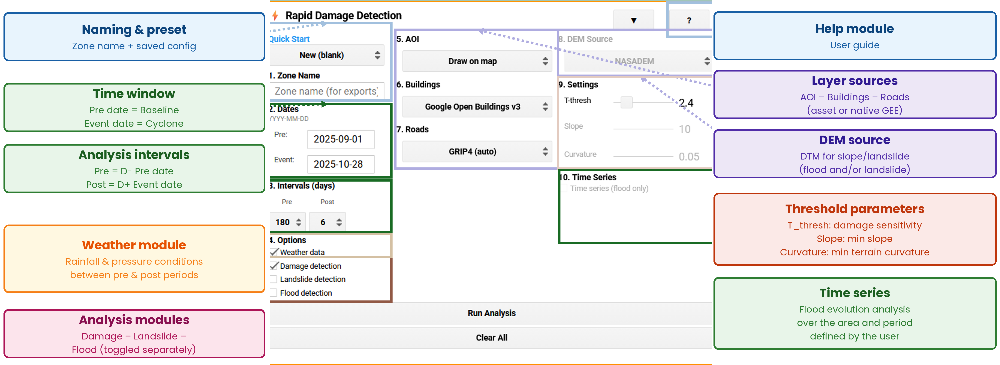

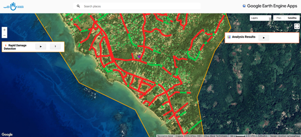

### Parameter configuration

#### Quick Start

Dropdown menu offering pre-saved configurations:
- **New (blank)**: Empty configuration
- **Demo: Jamaica Whitehouse (Oct 2025)**: Working example on Cyclone Melissa

To test the application, select the demo and click "Run Analysis" directly.

#### 1. Zone Name

Study area identifier used to name export files.

**Recommended format:** `Country_Event_Year`

Examples: `Haiti_Matthew_2016`, `Mozambique_Idai_2019`, `Philippines_Haiyan_2013`

#### 2. Dates (format YYYY-MM-DD)

**Pre-date (reference date)**
- Date prior to the event, representing normal conditions
- Choose a period without major events or extreme weather conditions
- Recommendation: choose a date sufficiently distant from the event so that PRE images are not contaminated by precursor effects (seasonal flooding, very wet vegetation). The `Weather data` module helps identify optimal dry periods before setting this date.

**Event date**
- Date of the disaster or the following day

**Constraint:** Pre-date < Event date

> **Important recommendation:** It is preferable to choose a Pre-date well before the event (1 to 6 months prior) to avoid PRE images already capturing event-related phenomena (pre-flooded areas, wind-stressed vegetation). For Whitehouse, Jamaica, the parameters used were `PRE_DATE = '2024-11-20'`, `EVENT_DATE = '2025-10-29'`, `PRE_INTERVAL = 180 days` (28 PRE images).

#### 3. Intervals (days)

**Pre (pre-event interval)**
- Time window to search for Sentinel-1 images before the reference date
- Range: 30 to 365 days
- **Recommendation: 180 days** — the wider the interval, the higher the probability of finding images during a dry period

**Post (post-event interval)**
- Time window to search for Sentinel-1 images after the event date
- Range: 1 to 28 days
- **Recommendation: 6 days** (corresponds to Sentinel-1 revisit period)
- If no image is found, the application suggests increasing this interval

> **Note:** Sentinel-1 has a revisit period of ~6 days. A post-event interval shorter than 6 days may not capture any acquisition. Activating the `Time series (flood)` module allows visualising the number and dates of available Sentinel-1 acquisitions over a period, helping to calibrate the optimal POST interval.

#### 4. Options (analysis modules)

**Weather data**
Cumulative precipitation (CHIRPS Daily), mean and maximum wind (GLDAS), atmospheric pressure (GLDAS). Recommendation: always activate to contextualise the event and identify optimal dry periods for choosing the Pre-date.


**Damage detection**
Detection of changes on buildings and roads. Based on pixel-wise t-test (PWTT). Applications: cyclones, earthquakes, conflicts. Generates damage classes (Moderate, High, Very High).

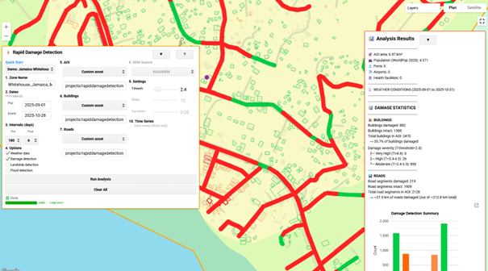


**Flood detection**
Mapping of flooded areas extent. Based on the s1flood algorithm (DeVries et al., 2020). Identifies flooded buildings and roads.

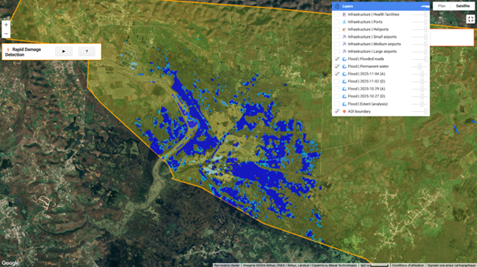

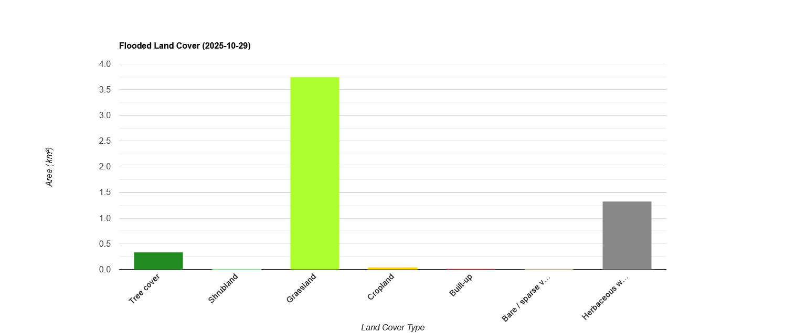

**Landslide detection**
Landslide susceptibility mapping. Combination of t-test and environmental factors (slope, curvature, precipitation, soil type). Generates runout exposure zones.

**Time series (flood only)**
Analysis of flood temporal evolution. Generates a chart showing progression/recession by date and orbit (ascending/descending). This chart also allows verifying the number of Sentinel-1 images available over a period, helping calibrate the POST interval before launching the analysis.


> This chart also shows the number of Sentinel-1 acquisitions available over the period, which helps calibrate the optimal POST interval before launching the main analysis.

**Recommendation:** For a first test, activate Weather + a single module (Damage or Flood) to reduce computation time.

#### 5. AOI (Area of Interest)

**Method 1: Draw on map** — Draw directly on the map. Recommended maximum area: ~50 km².

**Method 2: Enter WKT/GeoJSON** — Paste WKT or GeoJSON text from QGIS (plugin "Get WKT": select polygon > right-click > Get WKT).

**Method 3: Custom asset** — Use a pre-uploaded GEE asset. Format: `projects/YOUR_PROJECT/assets/YOUR_AOI` (FeatureCollection).

#### 6. Buildings (building data source)

| Option | Description | Coverage |
|--------|-------------|----------|
| Google Open Buildings v3 | Google database | Worldwide (excl. Europe/USA) |
| Google-Microsoft (VIDA Combined) | Merged database | Worldwide |
| Custom asset | Personal asset uploaded to GEE | Specific area |

Recommended selection: use the layer with the best score from Step 0. Otherwise, prefer "Google-Microsoft (VIDA Combined)".

#### 7. Roads (road data source)

| Option | Description |
|--------|-------------|
| GRIP4 (auto) | Global Roads Inventory Project, automatic region selection |
| Custom asset | Custom road network (FeatureCollection, LineString) |

#### 8. DEM Source

| Option | Resolution | Recommended use |
|--------|-----------|-----------------|
| NASADEM | 30m | Default (recommended) |
| SRTM | 30m | Alternative |
| ALOS | 30m | Tropical areas |
| ASTER | 30m | Less precise |
| Custom | Variable | Higher-quality local DEM |

#### 9. Settings (advanced parameters)

**T-threshold** (damage detection threshold) — Range: 2.0 to 5.0 | Default: **2.4**
- Increase = fewer false positives, risk of missing minor damage
- Decrease = more sensitive detection, increased false positive risk

**Slope** — Minimum slope for landslide. Default: 10°

**Curvature** — Minimum curvature. Default: 0.05

### Running the analysis

1. Verify all mandatory parameters are configured
2. Click **Run Analysis**

**Estimated duration:**
- Small area (< 10 km²): 1–3 minutes
- Medium area (10–30 km²): 3–8 minutes
- Large area (30–50 km²): 8–15 minutes

### Interpreting map results

#### Building damage levels

| Level | Condition | Meaning |
|-------|-----------|---------|
| **Moderate** | T_threshold ≤ T < T_threshold + 1 | Moderate change, validation recommended |
| **High** | T_threshold + 1 ≤ T < T_threshold + 2 | High change, strong probability of damage |
| **Very High** | T ≥ T_threshold + 2 | Very high change, near-certain damage |


### Exporting results

#### Method 1: Instant download (client-side)

GeoJSON format — compatible with QGIS, ArcGIS. Maximum 5000 features per layer.

Available files: `Analysis_Summary.csv`, `Buildings_Damage.geojson`, `Roads_Damage.geojson`, `Flooded_Buildings.geojson`, `Landslide_Buildings.geojson`

#### Method 2: Google Drive export (complete)

Full dataset without feature limit, including rasters (T-statistic GeoTIFF, flood extent, landslide susceptibility). Requires a Google Earth Engine account.

Procedure: results panel > "GOOGLE DRIVE EXPORT" section > "Tasks" tab > click "RUN" for each task.

### Troubleshooting

| Error message | Probable cause | Solution |
|---------------|----------------|----------|
| `No POST images - increase Post interval` | No Sentinel-1 image found | Increase Post interval to 7–14 days |
| `Invalid date format` | Incorrect date format | Use YYYY-MM-DD |
| `Pre-date must be before event` | Inverted dates | Check Pre-date < Event-date |
| `Draw an AOI first` | No study area defined | Draw a polygon or paste WKT |
| Calculation > 15 minutes | Area too large | Reduce AOI (< 50 km²) |

---

<a name="step-2"></a>
## Step 2: Affected Population Estimation (QGIS post-processing)

### Context

A standalone Python script (`Population_building.py`) allows crossing damaged buildings with population density data to estimate the number of affected inhabitants.

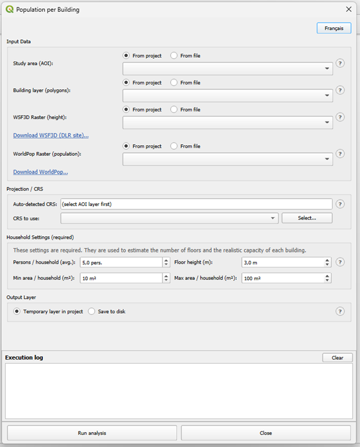

### Installation and launch

1. Download `Population_building.py` from `tools/`
2. Open QGIS (version 3.x)
3. Menu: **Plugins** > **Python Script Editor**
4. Open the `.py` file and click **Run**

### Required data

1. **Building layer**: `Buildings_Damage.geojson` (from the GEE application)
2. **Study area (AOI)**: polygon defining the analysis zone
3. **WSF3D Raster (height)** (optional but recommended) — downloadable at [https://download.geoservice.dlr.de/WSF3D/files/](https://download.geoservice.dlr.de/WSF3D/files/)
4. **WorldPop Raster (population)** — download link available in the interface

### Household parameters (required)

| Parameter | Description | Default |
|-----------|-------------|---------|
| Persons / household | Average household size | 5 |
| Floor height (m) | Standard floor height for floor count estimation | 3 m |
| Min area / household (m²) | Minimum residential floor area per household | 10 m² |
| Max area / household (m²) | Cap limiting the effect of large non-residential buildings | 100 m² |

### Output columns

The `Buildings_with_population` output layer contains two complementary estimates:
- **Pop_raw**: disaggregation by building volume (classic method)
- **Pop_settings**: disaggregation by estimated occupancy capacity (parametrised method, recommended)

Graduated symbology (yellow → red) is applied automatically using Jenks natural breaks.

### Correct interpretation

```
Correct formulation:
"Approximately 10,000 people are potentially affected (estimate ±40%)"

To avoid:
"Exactly 10,547 people are affected"
```

Apply an uncertainty margin of ±30–50% and cross-reference with other sources (local censuses, field surveys).

### Limitations

- WorldPop: ~100m resolution, statistical model
- WSF3D: 90m resolution — several buildings may share the same height value
- Non-residential buildings receive a population estimate based on their area — the `Max area / household` parameter limits this effect
- A metric CRS (UTM) is mandatory


---

<a name="scientific-methodology"></a>
# 2. Scientific Methodology

## 2.1 Sentinel-1 and SAR analysis for post-disaster assessment

### 2.1.1 The value of all-weather radar

Sentinel-1 (ESA, C-band, 5.405 GHz) acquires radar data independently of cloud cover and lighting conditions. This characteristic is critical in post-cyclone contexts, where cloud cover can block optical imagery for days to weeks after impact, as illustrated by the Beira (Mozambique, 2019) and Whitehouse, Jamaica (2025) cases.

### 2.1.2 SAR method families for damage assessment

According to Ge et al. (2020), SAR analysis methods for damage assessment fall into four main families:

**1. Intensity-based Change Detection**
Comparison of backscatter values between a pre-event and post-event image. This is the family to which this tool's method (T-statistic MEAN) belongs. It has the advantage of being applicable to standard GRD products without complex interferometric processing.

**2. Coherence-based Change Detection**
Exploitation of phase coherence loss between two acquisitions, highly sensitive to structural changes. Requires SLC (Single Look Complex) imagery and interferometric processing. Not implemented in this tool.

**3. Polarimetry-based Analysis**
Exploitation of radar signal polarimetric properties (covariance matrices, Pauli/Wishart decompositions, etc.) to characterise target structure changes. Requires full polarimetric data. Tested on Whitehouse (Wishart chi² method), results showed a non-discriminating signal on this standard GRD dataset (AUC ≈ 0.52, not different from random).

**4. Integrated approaches**
Combination of multiple methods or fusion with other sources (optical, DEM, field data). Represents the most promising avenue for future development.

This tool's approach belongs to the **first family** (intensity), making it directly applicable to Sentinel-1 GRD products freely available on Google Earth Engine.

---

## 2.2 Damage Detection Module

### 2.2.1 Physical principle — backscatter signal as a damage indicator

The principle relies on the modification of the radar signal by structural damage. An intact building generates a strong **double-bounce wall-ground mechanism** that reflects significant energy back towards the sensor. When this building is destroyed or severely damaged, this structure disappears and the signal drops abruptly.

The following example, measured on a building pixel of Whitehouse (Jamaica) on an ascending orbit, illustrates this phenomenon strikingly:

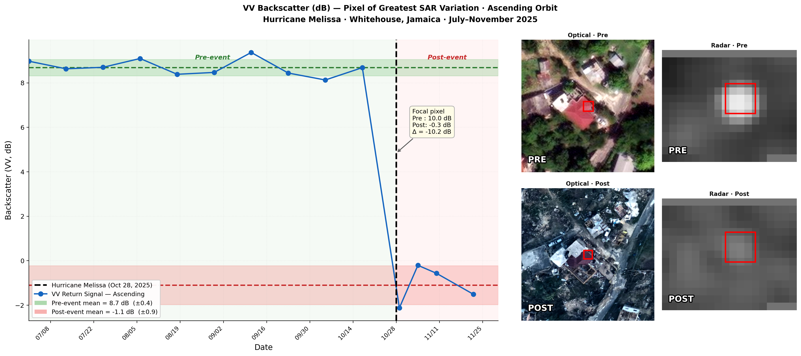

The VV backscatter time series (dB) shows a stable regime before Cyclone Melissa with a mean of **+8.7 dB** and low variability (±0.4 dB) over the July–October 2025 period, characteristic of a strong double-bounce mechanism. The cyclone's passage on 28 October 2025 causes a **sudden and persistent drop of −10.2 dB**, reflecting the destruction or severe deformation of the structure. This magnitude of change is well above the natural signal noise and is visually corroborated by the comparison of optical and radar pre/post-event images. This is precisely the type of statistical break that the PWTT T-statistic is designed to detect.

### 2.2.2 Processing pipeline — PWTT method

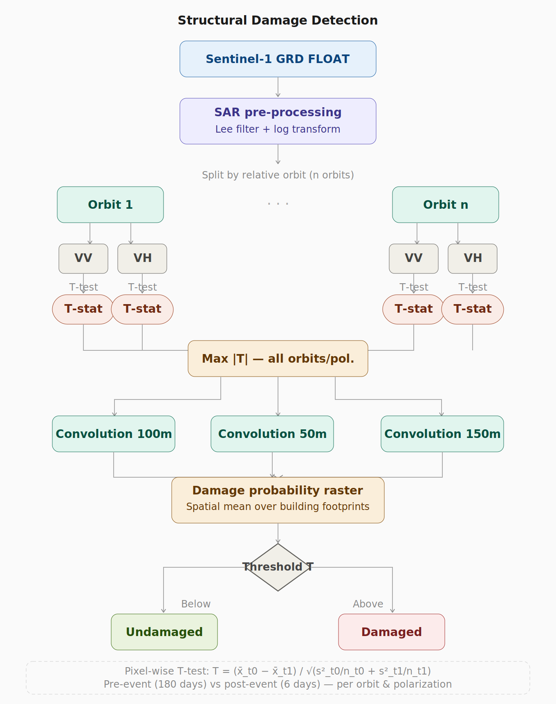

Damage detection is based on the **Pixel-Wise T-Test (PWTT)** method developed by Ballinger (2024). The complete pipeline is described in the diagram above and detailed below.

### 2.2.3 SAR data acquisition and pre-processing

**Filtering criteria:**
- Acquisition mode: IW (Interferometric Wide swath)
- Polarisation: VV + VH (dual-pol)
- Product type: GRD FLOAT (Ground Range Detected)
- Spatial resolution: 10m × 10m

**Time windows:**
```
Pre-window:  [Pre-date - Pre_interval] ──► [Pre-date]
Post-window:             [Event-date] ──► [Event-date + Post_interval]
```

**Speckle filtering**: adaptive Lee filter (Lee, 1980).

**Log transformation**: `σ_dB = 10 × log₁₀(σ⁰)` to normalise the value distribution.

### 2.2.4 Pixel-wise statistical test

For each pixel, a two-tailed t-test is applied separately per relative orbit and polarisation (VV and VH):

```
         μ_post - μ_pre
t = ─────────────────────────
    s_pooled × √(1/n_pre + 1/n_post)
```

The absolute value is used since only the magnitude of change matters. Results from all orbits and polarisations are merged by **maximum**: `T_final = max |T| — all orbits/pol.`

### 2.2.5 Multi-scale spatial smoothing and aggregation

```
T_smooth = (T_raw + T_50m + T_100m + T_150m) / 4
```

This smoothing reinforces coherent structures at 50–150m and attenuates isolated false positives. The **spatial mean** of T_smooth is then computed over each building footprint (`ee.Reducer.mean()`), and compared to the T_threshold (default 2.4) for Intact / Moderate / High / Very High classification.

---

## 2.3 Flood Detection Module

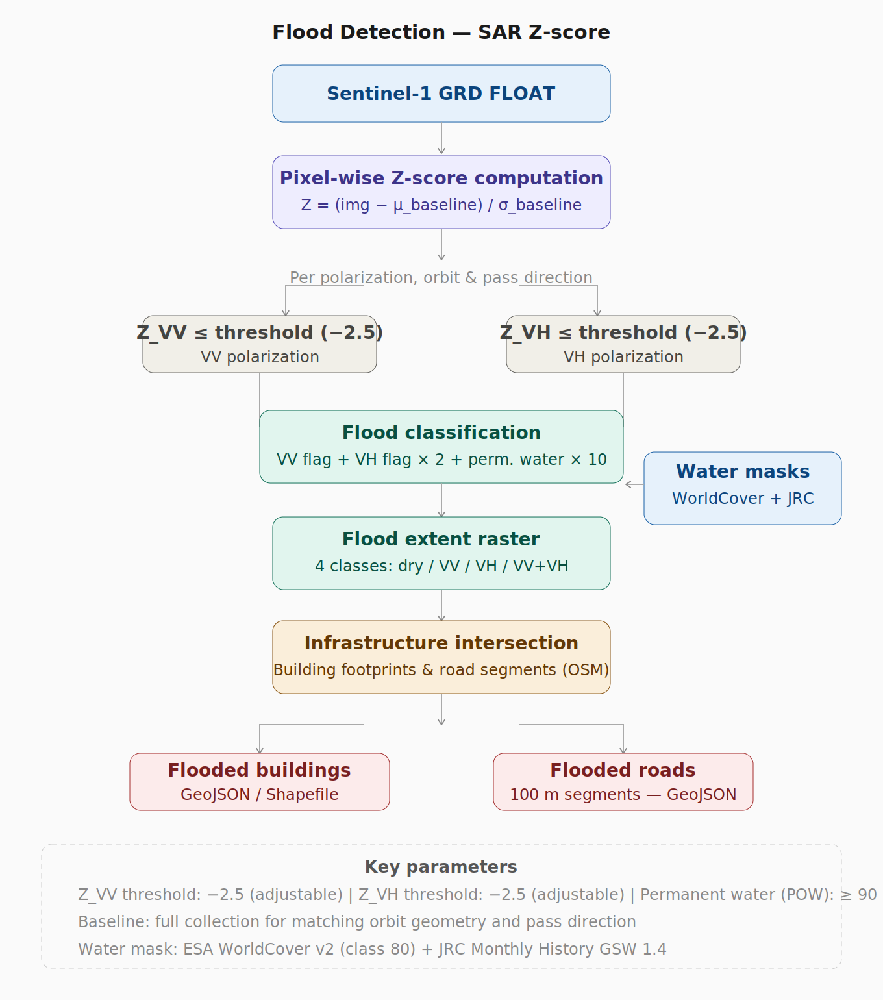

Based on the s1flood algorithm (DeVries et al., 2020). Pixel-wise z-score computation, separately per polarisation, orbit and pass direction:

```
z(x,y) = (I_post - μ_baseline) / σ_baseline
```

A pixel is classified as flooded if z_VV ≤ −2.5 or z_VH ≤ −2.5. The result is a 4-class raster: dry / VV only / VH only / VV+VH. Permanent water is masked (ESA WorldCover class 80 + JRC Monthly History GSW ≥ 90%). Post-processing: slope filtering (< 5°), connectivity filtering (≥ 8 connected pixels), spatial smoothing (25m radius). Intersection with building footprints and road segments produces GeoJSON exports.

---

## 2.4 Landslide Detection Module

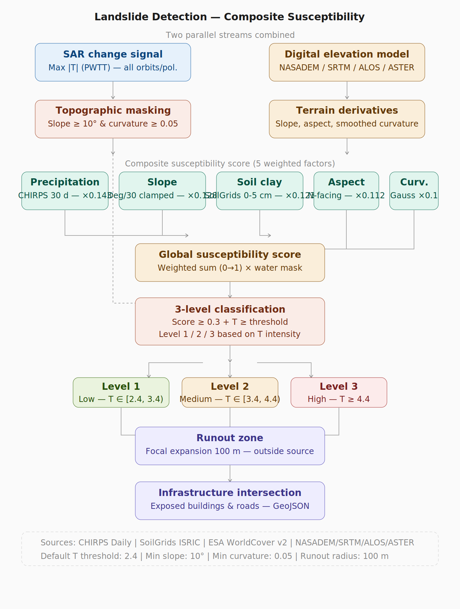

Two parallel streams are combined: the SAR change signal (Max |T| PWTT) and topographic derivatives from the DEM. A topographic mask (slope ≥ 10° and curvature ≥ 0.05) is applied to the SAR signal to limit false positives in flat areas.

The composite susceptibility score is a weighted sum of five factors (Kanani-Sadat et al., 2015):

| Factor | Source | Weight |
|--------|--------|--------|
| 30-day cumulative precipitation | CHIRPS Daily | 0.143 |
| Slope (deg/30, clamped) | DEM | 0.128 |
| Soil clay 0–5 cm | SoilGrids ISRIC | 0.123 |
| Aspect (north-facing) | DEM | 0.112 |
| Curvature (Gaussian) | DEM | 0.100 |

Final 3-level classification requires score ≥ 0.3 **and** T ≥ T_threshold:
- **Level 1 (Low)**: T ∈ [2.4, 3.4)
- **Level 2 (Medium)**: T ∈ [3.4, 4.4)
- **Level 3 (High)**: T ≥ 4.4

A 100m runout zone is computed by focal expansion around source areas.

---

## 2.5 Weather Statistics Module

| Variable | Source | Spatial resolution | Temporal resolution |
|----------|--------|--------------------|---------------------|
| Precipitation | CHIRPS Daily | 5.5 km | Daily |
| Wind | GLDAS NOAH v2.1 | 27.8 km | 3-hourly |
| Pressure | GLDAS NOAH v2.1 | 27.8 km | 3-hourly |

---

## 2.6 Methodological limitations

**Damage Detection:** sensitivity to soil moisture between PRE and POST acquisitions, confusion with vegetation debris, 10m resolution limiting for small buildings (< 100 m²), radar shadows and foreshortening in mountainous areas.

**Flood Detection:** dense vegetation masking underlying water, shallow water (< 10 cm) difficult to detect, flash floods shorter than 6 days potentially missed.

**Landslide Detection:** factor weights from literature, not regionally calibrated; 30m DEM resolution insufficient for micro-topographies.

**Weather Statistics:** limited spatial resolution (CHIRPS 5.5 km, GLDAS 27.8 km), sub-kilometre variability not captured.

---

<a name="interpretation"></a>
# 3. Results Interpretation and Usage Guide

> **Validation context:** The performance figures presented in this section are derived from the analysis of Cyclone Melissa (Jamaica, Whitehouse, 28–29 October 2025) over Zone 1 (1.57 km²), using parameters `PRE_DATE = '2024-11-20'`, `EVENT_DATE = '2025-10-29'`, `PRE_INTERVAL = 180 days` (28 PRE images). The reference layer was manually constructed from UNOSAT data ([UNOSAT FL20251030JAM](https://unosat.org/products/4215)), validated by photo-interpretation on NOAA very-high-resolution aerial imagery acquired on 31 October 2025. Due to geometric discrepancies between global building databases and ground reality, a dedicated building layer was manually reconstructed.

> **Validation sample limitations:** This validation is based on **563 buildings** (355 damaged, 208 undamaged) over **1.57 km²** — a limited sample concentrated on a single geographic area and a single event. Conclusions are statistically coherent but cannot be generalised with certainty to other regions, building types or event types. Given additional time or funding, these analyses will be extended to a larger number of buildings, areas and cyclonic events.

---

## 3.1 What the tool produces — and what it does not

The tool assigns each building a **radar change score (T-statistic)** measuring how much the Sentinel-1 signal has changed between the PRE and POST periods. This score is compared to a threshold to decide whether the building is classified as damaged.

> **The tool detects radar changes, not structural damage per se.** A building under reconstruction, a nearby construction site, or dense vegetation moving in the wind can generate a false positive. Conversely, an inward collapse without surface material displacement may go undetected.

The physical principle underlying the T-statistic is illustrated in section [2.2.1](#221-physical-principle--backscatter-signal-as-a-damage-indicator): on a building pixel of Whitehouse, the VV backscatter drop from +8.7 dB to −1.1 dB (Δ = −10.2 dB) after Cyclone Melissa constitutes a statistically unambiguous signal that the PWTT method is designed to capture.

---

## 3.2 Recommended parameters by POST time window

Performance was evaluated over 9 POST windows (1 to 120 days) with a fixed PRE period of 180 days (28 Sentinel-1 images).

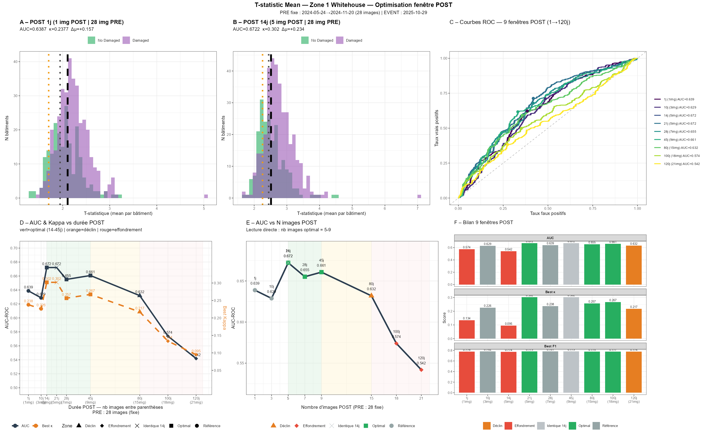

| POST window | N POST images | AUC | Best κ | Recommended threshold | Use |
|---|---|---|---|---|---|
| **1d** | 1 | 0.639 | 0.238 | 1.9–2.0 | Emergency triage D+24h |
| **6d** | 2 | 0.629 | 0.213 | 1.95 | Early triage |
| **14d (optimal)** | 5 | 0.672 | 0.302 | 2.3–2.5 | **Optimal analysis** |
| **28d** | 7 | 0.655 | 0.238 | 2.5 | Still reliable |
| **45d** | 9 | 0.661 | 0.267 | 2.5 | Boundary of reliable zone |
| **80d** | 15 | 0.632 | 0.217 | — | Notable decline |
| **>80d** | >15 | <0.60 | <0.15 | — | Not recommended |

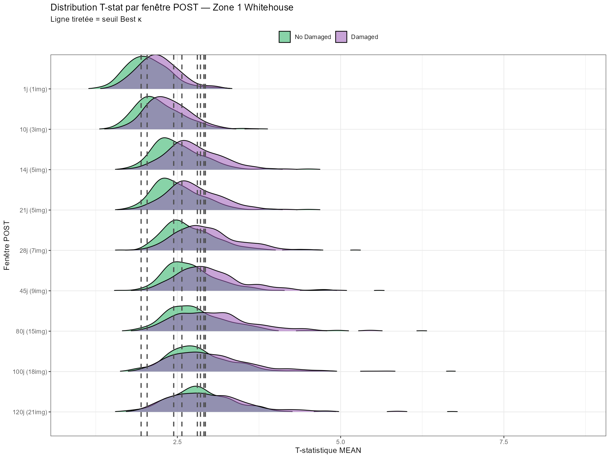

> **Practical rule:** Reconstruction progressively erases the damage signal. Beyond 15 POST images (~80 days), results become unreliable. Kappa drops to 0.095 at 120 days, indicating the classification is no better than random chance.

---

## 3.3 Guide by use case

### Use case 1 — Emergency triage (D+24h to D+48h)

**Context:** First hours after impact, before high-resolution optical imagery is available.

**Recommended parameters:** Post interval: `1` to `2` days | T-threshold: `1.9`

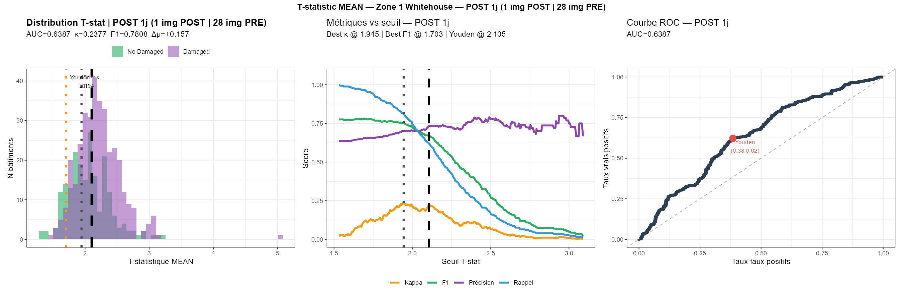

**Expected performance:**
- AUC ≈ 0.639 | Kappa ≈ 0.238
- ~60% of damaged buildings detected
- ~40% false alarms on undamaged buildings

> The tool reduces the inspection area by approximately half while retaining the majority of severe cases. With only one Sentinel-1 pass available, results depend entirely on the quality of that single image. If it is noisy (residual wind, high humidity), there is no fallback image.

**Recommendations:**
- Use to direct initial field teams and drone reconnaissance
- Prioritise zones classified as **Very High** (T ≥ T_threshold + 2)
- Do not use as the sole criterion for critical resource allocation
- Re-run the analysis at 14 days to confirm and refine

---

### Use case 2 — Operational mapping (D+14 to D+45)

**Context:** Planning of detailed assessment missions, support for photo-interpretation.

**Recommended parameters:** Post interval: `14` days (optimal) to `45` days | T-threshold: `2.4` (default)

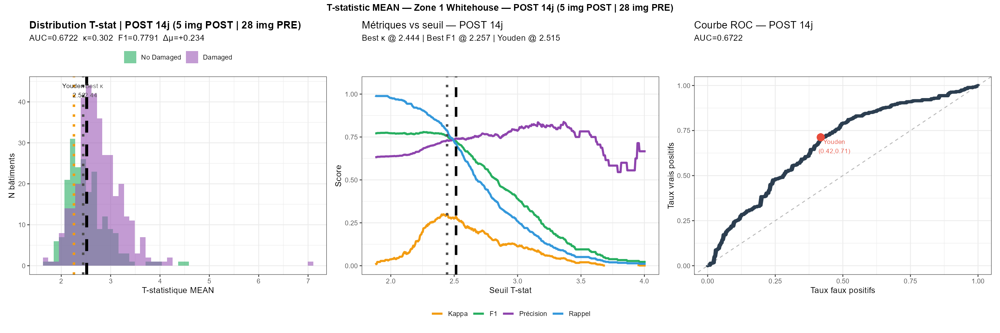

**Expected performance:**
- AUC ≈ 0.668–0.672 | Kappa ≈ 0.267–0.302
- ~62% of damaged buildings detected
- ~38% false alarms on undamaged buildings

> This is the optimal window. 5 POST images are averaged and absorb noise from any particularly noisy acquisition. The separation between damaged and undamaged buildings is the best observed across all tested windows.

**Recommendations:**
- Preferred use for post-cyclone damage mapping
- Cross-reference with confidence levels to prioritise inspections
- Overlay on HR optical imagery for photo-interpretation
- Do not use beyond 45 days without re-evaluating results

---

### Use case 3 — Assessment report and affected population estimation

**Context:** Production of statistics for emergency reports.

**Recommended parameters:** Post interval: `14` days | T-threshold: `2.4` | Activate **Weather data**

```
Correct formulation:
"In area X, Sentinel-1 analysis (POST 14d, T-threshold=2.4) identifies
N buildings as potentially damaged (of which X% Very High confidence).
This estimate requires validation by photo-interpretation. Uncertainty margin:
±30-40% (AUC=0.67, validated on 563 buildings / 1.57 km², Zone 1 Whitehouse,
Cyclone Melissa 2025)."

To avoid:
"N buildings are damaged."
```

**Recommendations:**
- Always indicate the POST interval used and the T threshold
- Distinguish Very High / High / Moderate in published statistics
- Mention the uncertainty margin and the validation sample size
- Do not present results as a certified assessment

---

### Use case 4 — Field and drone mission support

**Context:** Targeting areas to inspect as a priority.

**Recommended parameters:** Post interval: `6` to `14` days | T-threshold: `1.9` (recall) or `2.4` (precision)

1. Export `Buildings_Damage.geojson` from the application
2. Load into a mobile GIS (QField, ArcGIS Field Maps)
3. Use the `confidence` field to prioritise:
   - **Very High** — Absolute priority
   - **High** — As soon as possible
   - **Moderate** — If resources allow

**Recommendations:**
- Use the `T_statistic` field to manually refine prioritisation
- Document field results to improve future calibration

---

## 3.4 Interpreting confidence levels

| Level | Condition | Field interpretation | Expected true positive rate* |
|---|---|---|---|
| **Moderate** | T_threshold ≤ T < T_threshold + 1 | Moderate change, validation needed | ~55–65% |
| **High** | T_threshold + 1 ≤ T < T_threshold + 2 | High change, strong probability of damage | ~65–75% |
| **Very High** | T ≥ T_threshold + 2 | Very high change, near-certain damage | ~75–85% |

*Estimates derived from Zone 1 Whitehouse validation (563 buildings, Cyclone Melissa 2025).

---

## 3.5 Detection method comparison

Three methods were evaluated on Zone 1 data (POST 14d, N=479 buildings):

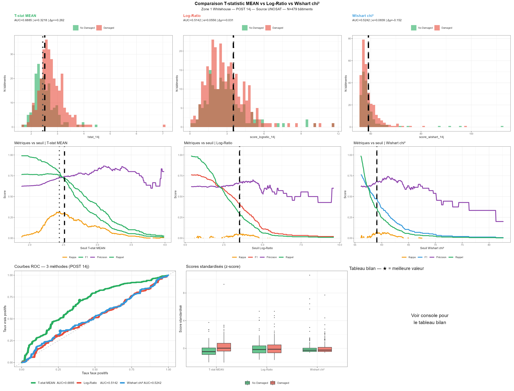

| Method | AUC | Best κ | Δμ (Damaged − Undamaged) | Verdict |
|---|---|---|---|---|
| **T-statistic MEAN** | **0.689** | **0.322** | **+0.262** | Recommended |
| Log-Ratio (dB) | 0.514 | 0.056 | +0.031 | Insufficient signal |
| Wishart chi² | 0.524 | 0.084 | −0.152 | Inverted signal |

The T-stat normalises the post-event change by the natural variability of each pixel during the PRE period. In tropical areas, this normalisation is essential. Log-Ratio and Wishart chi² work on raw values drowned in SAR speckle noise — their performance is equivalent to random chance on this GRD dataset.

---

## 3.6 PRE period selection — recommendations

The choice of Pre-date is critical for analysis quality. Several pitfalls should be avoided:

**Avoid wet or disturbed periods.** If the Pre-date is chosen during heavy rainfall, some areas may already be flooded or vegetation particularly water-saturated. These conditions will be reflected in the PRE images and the PRE→POST change will be underestimated, reducing detection capability.

**Choose a Pre-date distant from the event.** A Pre-date too close to the impact may include precursor phenomena (rising water before the cyclone, vegetation already flattened by wind). For Whitehouse, the chosen Pre-date is 20 November 2024 (one year before impact) — the 28 PRE images cover May–November 2024.

**Use the Weather data module to identify dry periods.** The daily precipitation chart allows verifying that the selected PRE period corresponds to a dry phase, without major hydrological events.

---

## 3.7 Effect of PRE period — 2024 vs 2025 comparison

A complementary analysis was conducted to evaluate the impact of PRE period choice on performance. Two configurations were compared on Zone 1 Whitehouse (POST 14d, N=563 buildings):
- **PRE 2024-11-20**: reference period one year before the event (reference configuration)
- **PRE 2025-10-20**: reference period 9 days before the impact

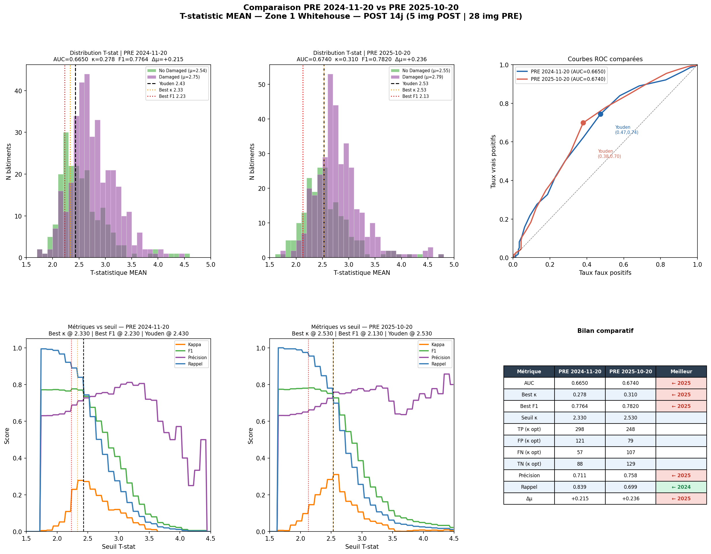

| Metric | PRE 2024-11-20 | PRE 2025-10-20 | Best |
|---|---|---|---|
| **AUC** | 0.665 | **0.674** | 2025 |
| **Best κ** | 0.278 | **0.310** | 2025 |
| **Best F1** | 0.776 | **0.782** | 2025 |
| Best κ threshold | 2.330 | 2.530 | — |
| Precision (@ κ opt.) | 0.711 | **0.758** | 2025 |
| Recall (@ κ opt.) | **0.839** | 0.699 | 2024 |
| Δμ | +0.215 | **+0.236** | 2025 |

In this specific case, the PRE 2025 period (closer to the event) yields better overall performance (AUC, Kappa, Precision), likely because seasonal conditions are more similar between the two compared periods. However, Recall is better with the PRE 2024 period, meaning more damaged buildings are detected. The choice therefore depends on the operational objective: priority to precision (PRE 2025) or priority to recall/miss nothing (PRE 2024).

> This result illustrates that there is no universal rule for PRE period selection. Using the Weather data module to identify periods of similar conditions between PRE and POST is a generally good practice.

---

## 3.8 Limitations specific to the Caribbean/tropical context

**Identified limiting factors:**
- **Dense tropical vegetation**: high SAR background noise, diluted damage signal
- **Small buildings** (< 100 m²): radar signature limited to a few pixels
- **Rapid reconstruction**: damage signal active for only 14–45 days
- **Post-cyclone humidity**: can modify backscatter independently of damage
- **Quality of global building databases**: significant geometric discrepancies with ground reality

> **Regarding generalisation:** These results were obtained on **563 buildings over 1.57 km²** during a single event. For areas with predominantly concrete buildings, dense urban fabric, or low-vegetation regions, performance could differ significantly. Complementary validations on other sites and events are needed — and planned if funding or collaborations allow.

---

## 3.9 T-threshold — adjustment guide

The `T-threshold` parameter (adjustable in Settings, default: **2.4**) is the main lever for adapting the tool's sensitivity.

| Objective | Recommended threshold | Effect |
|---|---|---|
| Miss no damaged building | **1.8 – 2.0** | More detections, more false alarms |
| Balance detection / precision | **2.3 – 2.5** | Default value, validated on Zone 1 |
| Minimise unnecessary field movements | **2.8 – 3.0** | Fewer detections, fewer false alarms |
| Absolute emergency D+1 | **1.9** | Maximum recall priority |

The per-window figures below show how Kappa, F1, Precision and Recall evolve with the chosen threshold:

| Window | Detailed figure (distribution + metrics + ROC) |
|---|---|
| POST 1d (1 img) |  |
| POST 10d (3 img) | 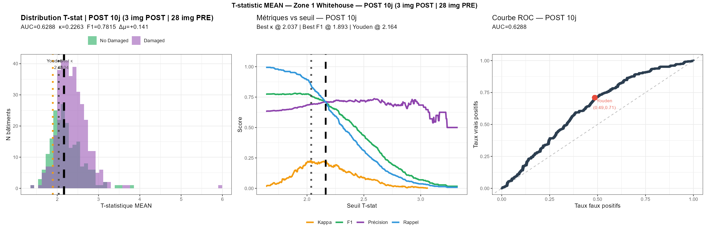 |
| POST 14d (5 img) — optimal |  |
| POST 21d (5 img) | 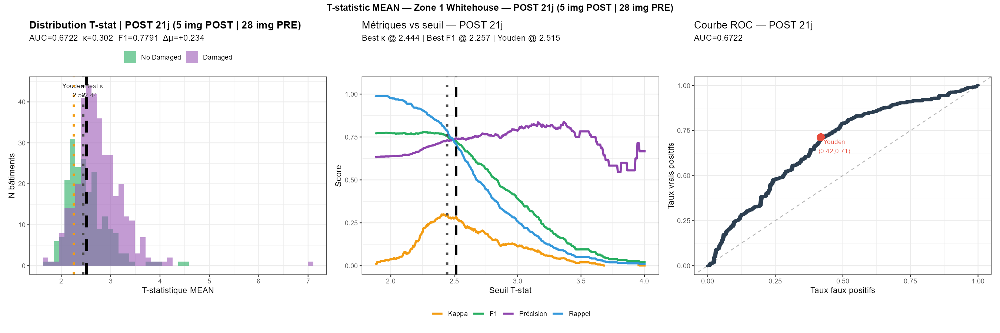 |
| POST 28d (7 img) | 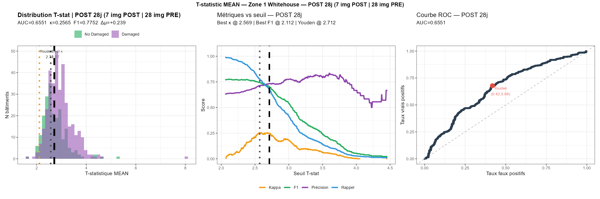 |
| POST 45d (9 img) | 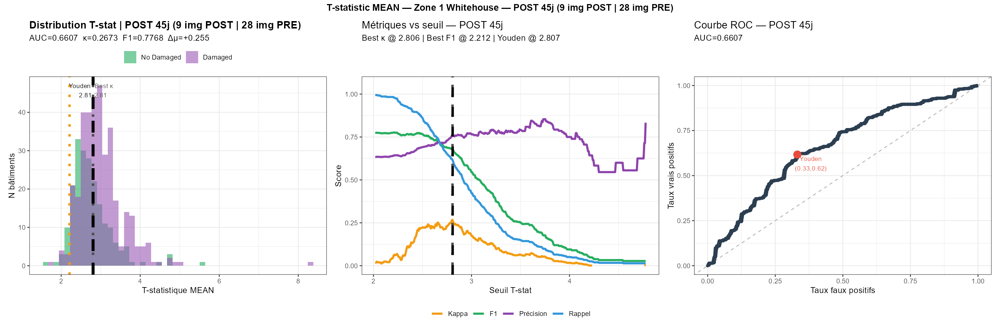 |
| POST 80d (15 img) | 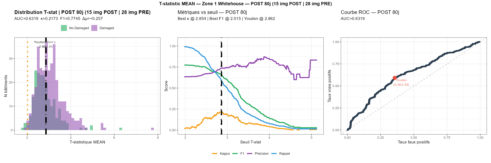 |
| POST 100d (18 img) | 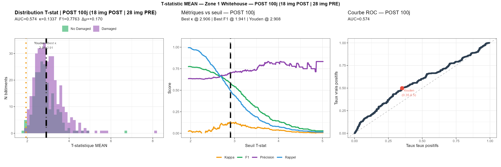 |
| POST 120d (21 img) | 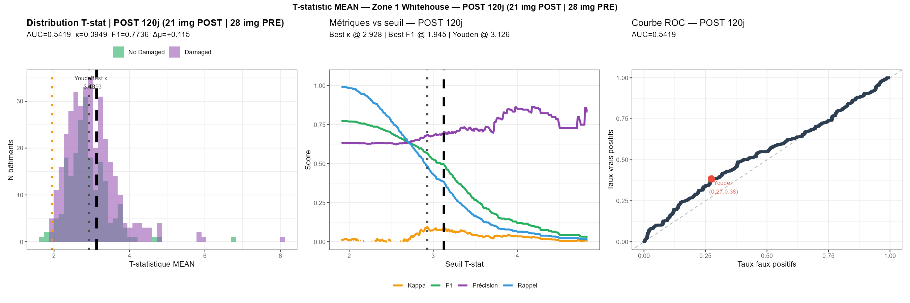 |

> In the absence of local validation data, use the default value of **2.4**.

---

## 3.10 Frequently asked questions on interpretation

**Q: My analysis shows 80% of buildings damaged. Is this realistic?**
Probably not. First check the number of available POST images and increase the T-threshold. Such a high rate usually indicates a threshold that is too low or a POST period that is too long with reconstruction already underway.

**Q: The analysis shows damage in areas clearly intact on optical imagery. What to do?**
These false positives may be caused by clearance work, vegetation changes or different weather conditions between PRE and POST acquisitions. Always cross-reference with available optical imagery before reporting statistics.

**Q: No building is detected even though the area is clearly affected. Why?**
Possible causes: noisy POST image, POST interval too short (< 6d), buildings too small (< 100 m²), or interior collapse without external modification visible to radar. Increase the POST interval and lower the T-threshold.

**Q: Are these results valid for other cyclones or regions?**
With caution. The validation only covers **563 buildings over 1.57 km²** during a single event (Cyclone Melissa, Jamaica, 2025). Complementary validations are planned if funding or collaborations allow.

**Q: How do I choose the best PRE period?**
Use the Weather data module to identify dry periods without major hydrological events. Prefer a period distant from the event (several months to one year) but within the same season for similar vegetation conditions.


---

<a name="data-sources"></a>
# 4. Data Sources

## 4.1 Satellite data

### 4.1.1 Sentinel-1 SAR

**Description:** C-band radar satellite constellation (5.405 GHz) by ESA.

**Specifications:**
- Satellites: Sentinel-1A (launched 2014), Sentinel-1C (2024)
- Acquisition mode: IW (Interferometric Wide Swath)
- Polarisation: Dual-pol (VV+VH)
- Spatial resolution: 10m × 10m (GRD)
- Swath: 250 km
- Revisit period: ~6 days
- GEE collection: `COPERNICUS/S1_GRD` and `COPERNICUS/S1_GRD_FLOAT`

**Reference:** ESA Sentinel Online: [https://sentinels.copernicus.eu/web/sentinel/missions/sentinel-1](https://sentinels.copernicus.eu/web/sentinel/missions/sentinel-1)

---

### 4.1.2 CHIRPS

**Description:** Daily precipitation combining satellite infrared and ground stations. Resolution: 0.05° (~5.5 km). GEE collection: `UCSB-CHG/CHIRPS/DAILY`

**Reference:** Funk, C., et al. (2015). *Scientific Data*, 2, 150066. [https://doi.org/10.1038/sdata.2015.66](https://doi.org/10.1038/sdata.2015.66)

---

### 4.1.3 GLDAS NOAH v2.1

**Description:** Global meteorological variables (wind, pressure). Resolution: 0.25° (~27.8 km), 3-hourly. GEE collection: `NASA/GLDAS/V021/NOAH/G025/T3H`

**Reference:** Rodell, M., et al. (2004). *Bulletin of the American Meteorological Society*, 85(3), 381–394. [https://doi.org/10.1175/BAMS-85-3-381](https://doi.org/10.1175/BAMS-85-3-381)

---

## 4.2 Digital Elevation Models

| Source | Resolution | Coverage | GEE Collection |
|--------|-----------|---------|----------------|
| NASADEM (recommended) | 30m | 60°N–56°S | `NASA/NASADEM_HGT/001` |
| SRTM | 30m | 60°N–56°S | `USGS/SRTMGL1_003` |
| ALOS World 3D v3.2 | 30m | 82°N–82°S | `JAXA/ALOS/AW3D30/V3_2` |
| ASTER GDEM v3 | 30m | 83°N–83°S | `NASA/ASTER_GED/AG100_003` |

---

## 4.3 Land cover data

**ESA WorldCover v200 (2021)** — 10m, 11 classes. GEE collection: `ESA/WorldCover/v200`

**JRC Global Surface Water** — 30m, monthly 1984–2022. GEE collection: `JRC/GSW1_4/MonthlyHistory`

---

## 4.4 Population data

**WorldPop** — 100m, Random Forest estimates. GEE collection: `WorldPop/GP/100m/pop`

**WSF 3D — Building Height** — 90m, building height. Download: [https://download.geoservice.dlr.de/WSF3D/files/](https://download.geoservice.dlr.de/WSF3D/files/)

---

## 4.5 Vector data

**Google Open Buildings v3** — ~1.8 billion buildings. GEE collection: `GOOGLE/Research/open-buildings/v3/polygons`

**Microsoft Building Footprints (VIDA Combined)** — >1 billion. GEE access: `projects/sat-io/open-datasets/VIDA_COMBINED/[ISO_CODE]`

**GRIP4** — Global road network. GEE access: `projects/sat-io/open-datasets/GRIP4/[REGION]`

**OurAirports** — Global airport database. Source: [https://ourairports.com/data/](https://ourairports.com/data/)

**Upply Seaports** — ~9,000 seaports. CC BY 4.0 licence. Mandatory attribution: "Data: Upply (upply.com)"

**OpenStreetMap** — ODbL licence. Mandatory attribution: "© OpenStreetMap contributors"

**SoilGrids ISRIC** — Clay content, 250m. GEE collection: `projects/soilgrids-isric/clay_mean`

---

## 4.6 Validation data (Whitehouse example)

**UNOSAT** — Post-Cyclone Melissa damage assessment, Zone 1 Whitehouse, Jamaica. [https://unosat.org/products/4215](https://unosat.org/products/4215)

**NOAA Aerial Imagery** — Very high resolution aerial imagery (15 cm, Digital Sensor System DSS version 6), acquired 31 October 2025 over Whitehouse, Jamaica.

GEE assets Whitehouse: `projects/rapiddamagedetection/assets/examples/jamaica_whitehouse_Melissa_28oct2025/`

---

<a name="bibliography"></a>
# 5. Bibliography

## 5.1 Core methods

**Ballinger, O. (2024).** Open access battle damage detection via pixel-wise t-test on Sentinel-1 imagery. *arXiv preprint*. [https://doi.org/10.48550/arXiv.2405.06323](https://doi.org/10.48550/arXiv.2405.06323)
— Foundational paper for the PWTT method used for damage detection.

**Ballinger, O. (2024).** PWTT: Pixel-Wise T-Test for battle damage detection [Source code]. GitHub. [https://github.com/oballinger/PWTT](https://github.com/oballinger/PWTT)

**DeVries, B., Huang, C., Armston, J., et al. (2020).** Rapid and robust monitoring of flood events using Sentinel-1 and Landsat data on the Google Earth Engine. *Remote Sensing of Environment*, 240, 111664. [https://doi.org/10.1016/j.rse.2020.111664](https://doi.org/10.1016/j.rse.2020.111664)
— s1flood algorithm used for the flood detection module.

**DeVries, B. (2019).** s1flood: Rapid flood mapping with Sentinel-1 on Google Earth Engine [Source code]. GitHub. [https://github.com/bendv/s1flood](https://github.com/bendv/s1flood)

**Handwerger, A. L., Huang, M.-H., Jones, S. Y., et al. (2022).** Generating landslide density heatmaps for rapid detection using open-access satellite radar data in Google Earth Engine. *Natural Hazards and Earth System Sciences*, 22(3), 753–774. [https://doi.org/10.5194/nhess-22-753-2022](https://doi.org/10.5194/nhess-22-753-2022)
— Landslide detection method using heatmaps.

**Kanani-Sadat, Y., Pradhan, B., Pirasteh, S., & Mansor, S. (2015).** Landslide susceptibility mapping using GIS-based statistical models. *Scientific Reports*, 5, 9899. [https://doi.org/10.1038/srep09899](https://doi.org/10.1038/srep09899)
— Source of AHP weights for the landslide susceptibility model.

---

## 5.2 SAR post-disaster analysis

**Ge, P., Gokon, H., Meguro, K., & Koshimura, S. (2020).** Study on the intensity and coherence information of high-resolution ALOS-2 SAR images for rapid urban damage detection. *Remote Sensing*, 12(15), 2409. [https://doi.org/10.3390/rs12152409](https://doi.org/10.3390/rs12152409)
— Classification of SAR methods into four families (intensity, coherence, polarimetry, integrated). Reference framework for this tool's approach.

**Barra, A., Reyes-Carmona, C., Mulas, J., et al. (2020).** SAR analysis for damage assessment: Cyclone Idai, Beira, Mozambique. *Remote Sensing*, 12(15), 2409. [https://doi.org/10.3390/rs12152409](https://doi.org/10.3390/rs12152409)
— Illustration of Sentinel-1's value over optical imagery during Cyclone Idai (Beira, 2019): SAR data available 12h after impact, clear optical imagery only available 12 days later.

---

## 5.3 SAR signal processing

**Lee, J.-S. (1980).** Digital image enhancement and noise filtering by use of local statistics. *IEEE Transactions on Pattern Analysis and Machine Intelligence*, PAMI-2(2), 165–168. [https://doi.org/10.1109/TPAMI.1980.4766994](https://doi.org/10.1109/TPAMI.1980.4766994)
— Adaptive Lee filter for speckle reduction.

**Student (1908).** The probable error of a mean. *Biometrika*, 6(1), 1–25. [https://doi.org/10.1093/biomet/6.1.1](https://doi.org/10.1093/biomet/6.1.1)
— Theoretical basis of the Student t-test.

---

## 5.4 Building data quality

**Fan, H., Zipf, A., Fu, Q., & Neis, P. (2014).** Quality assessment for building footprints data on OpenStreetMap with a reference dataset. *International Journal of Geographical Information Science*, 28(10), 2244–2262.

**ISO 19157:2013.** Geographic information — Data quality. International Organization for Standardization.

**Gonzales, J. J. (2023).** Building-level comparison of Microsoft and Google open building footprints datasets. *GIScience 2023*, LIPIcs, Vol. 277, Article 35. [https://doi.org/10.4230/LIPIcs.GIScience.2023.35](https://doi.org/10.4230/LIPIcs.GIScience.2023.35)

**Abdi, A. M., et al. (2021).** Inferring the positional accuracy of OpenStreetMap data using machine learning. *Transactions in GIS*, 25(4).

**Maidaneh Abdi, I., et al. (2023).** A regression/classification model of spatial accuracy prediction for OpenStreetMap buildings. *ISPRS Annals of the Photogrammetry, Remote Sensing and Spatial Information Sciences*.

**Breiman, L. (2001).** Random Forests. *Machine Learning*, 45(1), 5–32. [https://doi.org/10.1023/A:1010933404324](https://doi.org/10.1023/A:1010933404324)

**Dukai, B., et al. (2021).** A multi-source data integration approach for the assessment of building data quality. *International Journal of Digital Earth*.

**Gevaert, C. M., et al. (2024).** Auditing the quality of global building datasets in data-scarce regions. *Remote Sensing of Environment*, 305.

**Florio, P., et al. (2023).** Hierarchical conflation of multi-source building footprints. *Transactions in GIS*, 27(4).

---

## 5.5 Population and demography

**Tatem, A. J. (2017).** WorldPop, open data for spatial demography. *Scientific Data*, 4, 170004. [https://doi.org/10.1038/sdata.2017.4](https://doi.org/10.1038/sdata.2017.4)

**Esch, T., et al. (2022).** World Settlement Footprint 3D. *Remote Sensing of Environment*, 270, 112877. [https://doi.org/10.1016/j.rse.2021.112877](https://doi.org/10.1016/j.rse.2021.112877)

---

## 5.6 Data sources

**Funk, C., et al. (2015).** The climate hazards infrared precipitation with stations. *Scientific Data*, 2, 150066. [https://doi.org/10.1038/sdata.2015.66](https://doi.org/10.1038/sdata.2015.66)

**Rodell, M., et al. (2004).** The Global Land Data Assimilation System. *BAMS*, 85(3), 381–394. [https://doi.org/10.1175/BAMS-85-3-381](https://doi.org/10.1175/BAMS-85-3-381)

**Pekel, J.-F., et al. (2016).** High-resolution mapping of global surface water. *Nature*, 540, 418–422. [https://doi.org/10.1038/nature20584](https://doi.org/10.1038/nature20584)

**Zanaga, D., et al. (2022).** ESA WorldCover 10 m 2021 v200. [https://doi.org/10.5281/zenodo.7254221](https://doi.org/10.5281/zenodo.7254221)

**Meijer, J. R., et al. (2018).** Global patterns of current and future road infrastructure. *Environmental Research Letters*, 13(6). [https://doi.org/10.1088/1748-9326/aabd42](https://doi.org/10.1088/1748-9326/aabd42)

**Google Earth Engine Team (2024).** Google Earth Engine Documentation. [https://developers.google.com/earth-engine](https://developers.google.com/earth-engine)

---

<a name="licence"></a>
# 6. Licence and Contributions

## 6.1 Project licence

This project is distributed under the **MIT licence**.

```
MIT License
Copyright (c) 2026 Fabrice Renoux
Permission is hereby granted, free of charge, to any person obtaining a copy
of this software and associated documentation files (the "Software"), to deal
in the Software without restriction, including without limitation the rights
to use, copy, modify, merge, publish, distribute, sublicense, and/or sell
copies of the Software, and to permit persons to whom the Software is
furnished to do so, subject to the following conditions:
The above copyright notice and this permission notice shall be included in all
copies or substantial portions of the Software.
THE SOFTWARE IS PROVIDED "AS IS", WITHOUT WARRANTY OF ANY KIND, EXPRESS OR
IMPLIED, INCLUDING BUT NOT LIMITED TO THE WARRANTIES OF MERCHANTABILITY,
FITNESS FOR A PARTICULAR PURPOSE AND NONINFRINGEMENT.
```

## 6.2 Third-party data licences

| Data | Licence | Attribution required |
|------|---------|---------------------|
| Sentinel-1 | Copernicus Open Access | "Contains modified Copernicus Sentinel data [Year]" |
| CHIRPS | Creative Commons | "CHIRPS data provided by UCSB Climate Hazards Center" |
| GLDAS | NASA Open Data | "Data: NASA GLDAS" |
| NASADEM, SRTM, ASTER | NASA/USGS Open Data | "Data: NASA/USGS" |
| ESA WorldCover | ESA Open Data | "Contains ESA WorldCover data [Year]" |
| JRC Global Surface Water | European Commission Open Data | "Data: EC JRC" |
| WorldPop | CC BY 4.0 | "Data: WorldPop (www.worldpop.org)" |
| Google Open Buildings | CC BY 4.0 | "Data: Google Open Buildings" |
| Microsoft Buildings | ODbL | "Data: Microsoft" |
| GRIP4 | CC BY 4.0 | "Data: GRIP4 (Meijer et al., 2018)" |
| Upply Seaports | CC BY 4.0 | "Data: Upply (upply.com)" — MANDATORY |
| OpenStreetMap | ODbL | "© OpenStreetMap contributors" — MANDATORY |
| SoilGrids | CC BY 4.0 | "Data: ISRIC SoilGrids" |

## 6.3 Citing this tool

**APA format:**
```
Renoux, F. (2026). Rapid Damage Detection Tool: Post-disaster assessment using
Sentinel-1 SAR data on Google Earth Engine [Software].
GitHub repository: https://github.com/renouxfabrice/Rapid-Cyclone-Damage-Mapping
```

**BibTeX format:**
```bibtex
@software{renoux2026rapid,
  author = {Renoux, Fabrice},
  title = {Rapid Damage Detection Tool},
  year = {2026},
  publisher = {GitHub},
  url = {https://github.com/renouxfabrice/Rapid-Cyclone-Damage-Mapping},
  note = {Master's thesis project, AgroParisTech SILAT}
}
```

## 6.4 Contributions

Contributions are welcome. To contribute:
1. Fork the repository
2. Create a branch: `git checkout -b feature/AmazingFeature`
3. Commit: `git commit -m 'Add AmazingFeature'`
4. Push: `git push origin feature/AmazingFeature`
5. Open a Pull Request

To report a bug or propose a feature, open an **Issue**: [https://github.com/renouxfabrice/Rapid-Cyclone-Damage-Mapping/issues](https://github.com/renouxfabrice/Rapid-Cyclone-Damage-Mapping/issues)

## 6.5 Contact and support

**Author:** Fabrice Renoux
**Institution:** AgroParisTech - Mastère Spécialisé SILAT
**Email:** renoux.fabrice@hotmail.fr
**Response time:** 3–5 business days (academic project, support not guaranteed)

## 6.6 Acknowledgements

**Owen Ballinger** for developing the PWTT method and sharing the source code.
**Ben DeVries** for the s1flood algorithm and associated documentation.
**Alexander Handwerger** and **Mong-Han Huang** for the landslide detection methods.
**Google Earth Engine Team** for the processing platform and data access.
**ESA Copernicus** for Sentinel-1 data.
All **contributors to open databases** (OpenStreetMap, Google, Microsoft, etc.).
The **SILAT Master's teaching team** for supervising the project.

---

# 7. Repository Structure

```
Rapid-Cyclone-Damage-Mapping/
│
├── README.md                           # French version (complete documentation)
├── README.en.md                        # This file (English version)
├── LICENSE                             # MIT Licence
│
├── app/
│   └── rapid_damage_detection.js       # JavaScript source code (Google Earth Engine)
│
├── tools/
│   ├── building_quality_comparison.py  # QGIS building comparison script (standalone Python)
│   └── Population_building.py          # QGIS population estimation script (standalone Python)
│
├── docs/
│   ├── guide_comparaison_bati.docx     # User guide — building comparison
│   ├── guide_population_batiment.docx  # User guide — population per building
│   └── screenshots/                    # Application and analysis screenshots
│       ├── Dashboard_EN.png
│       ├── Dashboard_fr.png
│       ├── damage_detection_PWTT_EN.png
│       ├── damage_detection_PWTT.png
│       ├── flood_detection_EN.png
│       ├── flood_detection_FR.png
│       ├── landslide_detection_EN.png
│       ├── landslide_detection.png
│       ├── backscatter_whitehouse_ascending_EN.png
│       ├── backscatter_whitehouse_ascending_FR.png
│       ├── Building_Quality_Comparison_fenetre_eng.png
│       ├── Building_Quality_Comparison_Summary-result.png
│       ├── Pop_building_fenetre_eng.png
│       ├── apps_presentation_resultat_mapsosm.png
│       ├── apss_presnetation_resultat_mapsat.png
│       ├── apps_affichage_des_couches.png
│       ├── resultat_carte_flood_2.png
│       ├── bubble_et_hub_barycentre.png
│       ├── graph_apps_Pluviometreie_serie_temporelle.png
│       ├── graph_fllod_area_serie_temporelle.png
│       ├── graph_repartition_etat_batis_et_route.png
│       ├── graph_flood_land_cover.png
│       ├── 1773509531511_image.png
│       ├── fig1_tstat_optimisation_fenetres.png
│       ├── fig2_ridge_distributions.png
│       ├── fig3_comparaison_3methodes.png
│       ├── fig_window_1j.png → fig_window_120j.png
│       └── fig_window_14jpre2025_vs_14jpre2024.png
│
├── examples/
│   └── jamaica_whitehouse_2025/
│       └── README.md
│
└── CHANGELOG.md
```

---

# 8. Installation and Deployment

## 8.1 For users

No installation required. Direct access:
[https://rapiddamagedetection.projects.earthengine.app/view/rapid-damage-detection-app](https://rapiddamagedetection.projects.earthengine.app/view/rapid-damage-detection-app)

## 8.2 For developers

```bash
git clone https://github.com/renouxfabrice/Rapid-Cyclone-Damage-Mapping.git
cd rapid-damage-detection
```

Deploy via Google Earth Engine Code Editor: copy the contents of `app/rapid_damage_detection.js`, paste into the editor, click **Apps** > **New App**.

---

# 9. FAQ

**Q1: Can the tool be used for operational interventions?**
No. This tool is experimental and intended for research. Results must be validated by experts before any operational use.

**Q2: Why do my results differ between two analyses of the same area?**
New Sentinel-1 images available, parameter changes, updated auxiliary data, variability in SAR acquisition conditions.

**Q3: Can I use the tool for other types of disasters?**
The Damage Detection module can detect SAR changes for forest fires. For droughts, Sentinel-1 alone is insufficient.

**Q4: How long should I wait after an event?**
Ideally 3–7 days to guarantee at least one post-event Sentinel-1 acquisition. A D+1 analysis is possible and useful for rapid triage (see section 3.3).

**Q5: Does the tool work in polar or desert areas?**
Polar areas: DEMs limited to 60°N–56°S. Desert areas: yes, but sand changes can generate false positives.

**Q6: Can I use my own building/road data?**
Yes. Use the "Custom asset" option on Google Earth Engine. Format: FeatureCollection (polygons for buildings, lines for roads).

**Q7: Is data stored anywhere?**
No. The application stores no user data. Google Drive exports are stored in the user's personal Drive.

**Q8: Can the tool analyse very large areas?**
For areas > 100 km², computation may take over 30 minutes and fail. Solution: divide into multiple sub-areas.

---

# 10. Glossary

| Term | Definition |
|------|-----------|
| **AOI** | Area of Interest — Study area defined by the user |
| **AUC** | Area Under the Curve — Area under the ROC curve, discriminative performance measure (0.5 = random, 1 = perfect) |
| **CHIRPS** | Climate Hazards Group InfraRed Precipitation with Station data |
| **DEM** | Digital Elevation Model |
| **GEE** | Google Earth Engine — Geospatial processing platform |
| **GLDAS** | Global Land Data Assimilation System — Global meteorological data |
| **GRD** | Ground Range Detected — Sentinel-1 Level-1 product |
| **IW** | Interferometric Wide swath — Sentinel-1 acquisition mode |
| **JRC** | Joint Research Centre — European Commission research centre |
| **Kappa (κ)** | Cohen's Kappa coefficient — agreement beyond chance (0 = random, 1 = perfect) |
| **MAD** | Median Absolute Deviation — Robust measure of statistical dispersion |
| **NASADEM** | Global DEM reprocessed by NASA from SRTM |
| **PWTT** | Pixel-Wise T-Test — T-test applied pixel by pixel |
| **ROC** | Receiver Operating Characteristic — Curve representing classifier performance |
| **SAR** | Synthetic Aperture Radar |
| **SRTM** | Shuttle Radar Topography Mission |
| **T-statistic** | Radar change score normalised by PRE variability |
| **VH/VV** | Radar polarisations (Vertical-Horizontal / Vertical-Vertical) |
| **WorldCover** | ESA land cover map at 10m resolution |
| **WorldPop** | Disaggregated population data at 100m |
| **z-score** | Normalised deviation — (value − mean) / standard deviation |

---

**END OF README**

For any questions: renoux.fabrice@hotmail.fr
Online application: [https://rapiddamagedetection.projects.earthengine.app/view/rapid-damage-detection-app](https://rapiddamagedetection.projects.earthengine.app/view/rapid-damage-detection-app)
GitHub repository: [https://github.com/renouxfabrice/Rapid-Cyclone-Damage-Mapping](https://github.com/renouxfabrice/Rapid-Cyclone-Damage-Mapping)

---

© 2026 Fabrice Renoux - AgroParisTech SILAT - MIT Licence

Made with dedication for disaster response and humanitarian action
