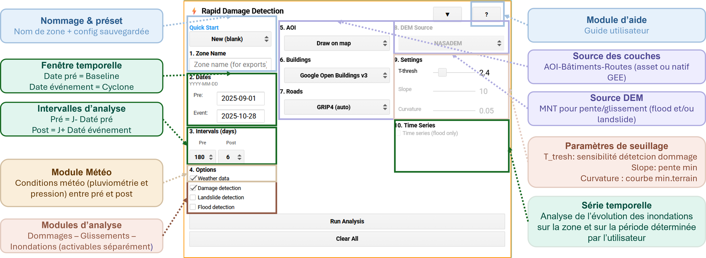
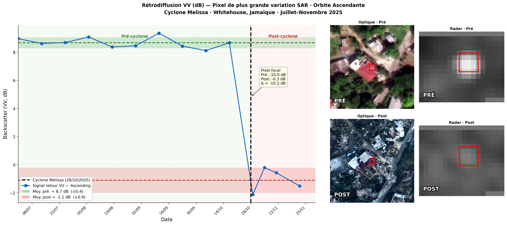
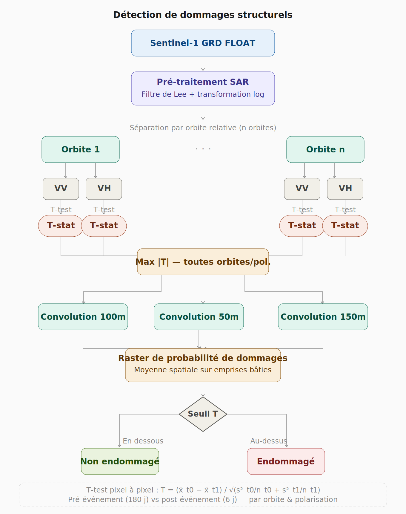
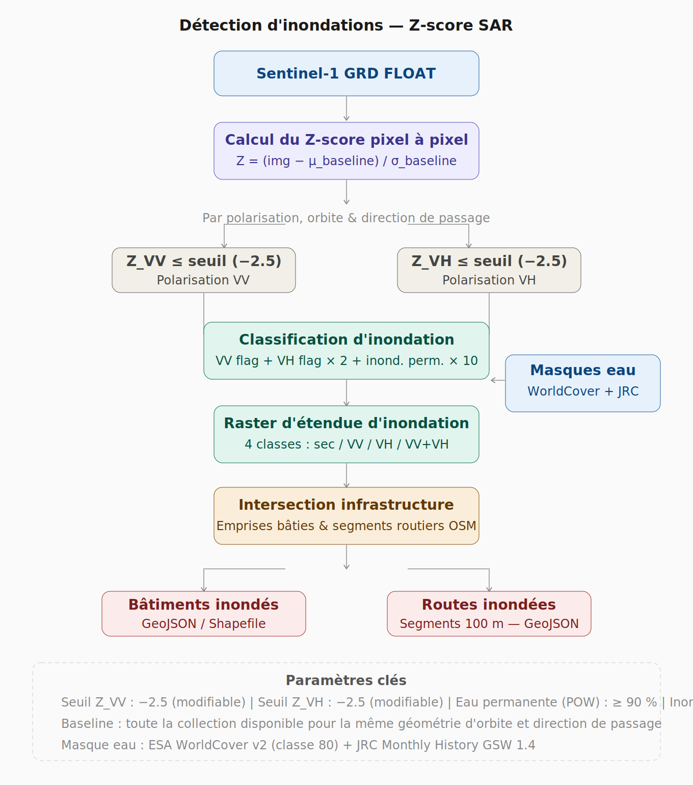
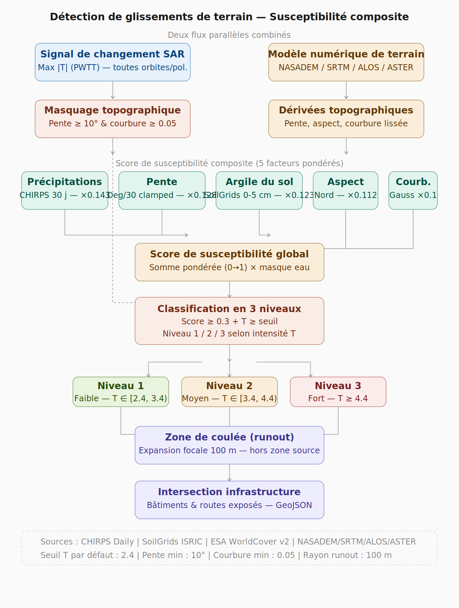

# Rapid-Cyclone-Damage-Mapping

Ce dépôt GitHub héberge un outil de détection rapide des dégâts développé dans le cadre d'un travail académique utilisant le radar Sentinel-1. Il fournit une cartographie préliminaire des dégâts potentiels post-cyclone, principalement pour orienter la photo-interprétation détaillée, guider les missions terrain et drone, et doit être validé par imagerie haute résolution.

# Rapid Damage Detection Tool

**Language / Langue :** 🇬🇧 [English](README.en.md) | 🇫🇷 Français

---

**Auteur :** Fabrice Renoux
**Institution :** AgroParisTech - Mastère Spécialisé SILAT (Systèmes d'Informations Localisées pour l'Aménagement des Territoires)
**Date :** Mars 2026

---

## Avertissement

Ce projet constitue un **travail universitaire à caractère expérimental**. Il ne doit en aucun cas être considéré comme un outil opérationnel certifié pour des interventions d'urgence.

**Limitations importantes :**
- Les résultats sont fournis à titre indicatif et nécessitent une validation systématique par des experts
- L'outil ne remplace pas la photo-interprétation sur imagerie haute résolution
- Ne doit pas servir de base unique pour des décisions opérationnelles critiques
- Destiné à la recherche et à l'expérimentation académique
- L'auteur décline toute responsabilité quant à l'utilisation des résultats

**Usage recommandé :** Outil d'aide à la décision pour orienter et prioriser les analyses détaillées réalisées par des professionnels qualifiés.

---

## Contexte et Objectifs

### Problématique

Dans les premières heures suivant une catastrophe naturelle (cyclone tropical, séisme), l'évaluation rapide des dégâts se heurte à plusieurs contraintes :

1. **Délai d'acquisition** : Les images satellites optiques haute résolution peuvent nécessiter plusieurs jours avant d'être disponibles
2. **Conditions météorologiques** : La couverture nuageuse post-événement limite l'exploitation de l'imagerie optique
3. **Volume de données** : Le traitement manuel par photo-interprétation est chronophage et nécessite des expertises spécialisées
4. **Prioritisation** : Difficulté à identifier rapidement les zones nécessitant une intervention urgente

### L'apport de Sentinel-1 face à l'imagerie optique

L'exemple du Cyclone Idai (Beira, Mozambique, mars 2019) illustre bien cette contrainte. Comme le documentent Barra et al. (2020), la dernière image optique sans nuages de la ville de Beira datait du 2 mars, soit 12 jours avant le cyclone. La première image optique claire après l'impact n'était disponible que le 26 mars, et l'évaluation complète fondée sur l'optique n'a été publiée que le 4 avril — soit trois semaines après l'impact. Durant tout ce temps, Sentinel-1 fournissait des données exploitables dès 12 heures après l'impact, avec des mises à jour possibles tous les 6 jours.

Le cas de Whitehouse, Jamaïque (Cyclone Melissa, 28-29 octobre 2025) confirme ce constat sur un exemple récent. Le tableau suivant récapitule les dates clés d'acquisition et de publication des produits d'évaluation :


On constate que des données Sentinel-1 étaient disponibles dès le 29 octobre 2025 (jour de l'impact), permettant une pré-analyse immédiate avec cet outil. L'évaluation UNOSAT n'a été publiée que le 5 novembre — soit 7 jours plus tard, pendant lesquels 3 acquisitions Sentinel-1 supplémentaires étaient déjà disponibles. L'imagerie satellitaire optique à 50 cm (Maxar/Copernicus EMS) n'a quant à elle été accessible que le 18 novembre, soit 20 jours après l'impact, au moment où 5 images Sentinel-1 couvraient déjà la zone.

### Solution proposée

Cet outil exploite les données radar **Sentinel-1** (bande C, acquisition tout-temps) pour :

1. Générer une première cartographie indicative des zones potentiellement affectées dès J+1
2. Prioriser les secteurs nécessitant une photo-interprétation détaillée
3. Cibler les reconnaissances terrain et les missions drone
4. Accélérer le processus d'évaluation rapide des équipes d'urgence

**Applications principales :**
- **Post-cyclone tropical** : dégâts structurels, inondations, glissements de terrain
- **Post-séisme** : détection de changements structurels sur le bâti

**Principe :** L'outil ne produit pas une évaluation définitive, mais une **trame des dommages potentiels** devant être systématiquement validée par analyse visuelle d'imagerie haute résolution et vérifications terrain.

---

## Accès à l'application

**URL de l'application Google Earth Engine :**
[https://rapiddamagedetection.projects.earthengine.app/view/rapid-damage-detection-app](https://rapiddamagedetection.projects.earthengine.app/view/rapid-damage-detection-app)

**Prérequis :**
- Navigateur web moderne (Chrome, Firefox, Edge)
- Compte Google (gratuit)
- Connexion internet stable

**Pas d'installation nécessaire** - L'application fonctionne entièrement en ligne via Google Earth Engine Apps.

---

## Table des matières

1. [Guide utilisateur](#guide-utilisateur)
   - [Etape 0 : Evaluation qualité des données bâti (optionnel)](#étape-0)
   - [Etape 1 : Utilisation de l'application GEE](#étape-1)
   - [Etape 2 : Estimation de population affectée (post-traitement)](#étape-2)
2. [Méthodologie scientifique](#méthodologie-scientifique)
3. [Interprétation des résultats et guide par usage](#interpretation)
   - [Ce que l'outil produit](#31-ce-que-loutil-produit--et-ce-quil-ne-produit-pas)
   - [Paramètres recommandés par fenêtre](#32-paramètres-recommandés-selon-la-fenêtre-temporelle)
   - [Guide par cas d'usage](#33-guide-par-cas-dusage)
   - [Niveaux de confiance](#34-interprétation-des-niveaux-de-confiance)
   - [Comparaison des méthodes](#35-comparaison-des-méthodes-de-détection)
   - [Choix de la période PRE](#36-choix-de-la-période-pre--recommandations)
   - [Comparaison périodes PRE](#37-effet-de-la-période-pre--comparaison-2024-vs-2025)
   - [Limites contexte tropical](#38-limites-spécifiques-au-contexte-caribéen--tropical)
   - [Réglage du seuil T](#39-seuil-t--guide-de-réglage)
   - [FAQ interprétation](#310-questions-fréquentes-sur-linterprétation)
4. [Sources de données](#sources-données)
5. [Bibliographie](#bibliographie)
6. [Licence et contributions](#licence)

---

<a name="guide-utilisateur"></a>
# 1. Guide utilisateur

<a name="étape-0"></a>
## Etape 0 : Evaluation de la qualité des données bâti (optionnel)

### Contexte

Google Earth Engine propose plusieurs bases de données bâti mondiales dont la qualité varie selon les régions :
- Google Open Buildings v3
- Microsoft Building Footprints (via VIDA Combined)
- Assets personnalisés

Un script Python autonome (`building_quality_comparison.py`) exécutable depuis l'éditeur de scripts QGIS permet de comparer ces sources avec une couche de référence locale pour identifier la plus adaptée à votre zone d'étude.


### Installation et lancement

Aucune installation de plugin n'est requise. Le script est un fichier Python autonome.

1. Télécharger `building_quality_comparison.py` depuis `tools/`
2. Ouvrir QGIS (version 3.x)
3. Menu : **Extensions** > **Editeur de scripts Python**
4. Ouvrir le fichier `.py` via l'icône dossier
5. Cliquer sur **Exécuter** (triangle vert) : la fenêtre s'ouvre immédiatement

### Utilisation — étape par étape

**A — Reference Layer (couche de référence)**
Choisir la couche servant de référence terrain (cadastre, données de terrain, numérisation haute résolution). Deux modes : `From project` ou `From file`. Le nombre de bâtiments et le CRS s'affichent automatiquement.

**B — Study Layers (couches à évaluer)**
Ajouter entre 1 et 5 couches via le bouton `Add layer`. Pour chaque couche, choisir la source et renseigner un nom d'affichage (alias) qui sera utilisé dans les rapports.

**C — Area of Interest (masque optionnel)**
Cocher la case pour restreindre l'analyse à une zone précise. Si laissée vide, tous les bâtiments visibles sont analysés.

**D — Projection / CRS**
Le CRS UTM adapté est détecté automatiquement depuis l'emprise de la couche de référence. Une alerte rouge s'affiche si un CRS non métrique est sélectionné — les calculs de distance seraient inexacts.

**E — Matching Parameters (paramètres d'appariement)**
L'analyse de sensibilité automatique (recommandée) teste 16 combinaisons de paramètres (distances × Jaccard) et retient celle qui maximise le F1-score. Le mode manuel permet de renseigner directement distance centroïde maximale et indice de Jaccard minimum.

**F — Score Weights et Output**
Ajuster si besoin les poids du score global. Définir un dossier de sortie pour les rapports texte. Cliquer sur `Run analysis`.

### Résultats dans QGIS

Trois couches sont créées par couche évaluée : bâtiments appariés (vert), bâtiments non détectés (violet), bâtiments en excès (rouge).


### Indicateurs clés

| Indicateur | Interprétation | Valeur excellente | Valeur acceptable | Valeur faible |
|------------|----------------|-------------------|-------------------|---------------|
| Exhaustivité (Completeness) | Part des bâtiments REF détectés | > 90% | 70-90% | < 70% |
| Sur-complétion (Commission error) | Part des bâtiments sans équivalent REF | < 5% | 5-15% | > 15% |
| F1-score | Indicateur synthétique (ISO 19157) | > 0.80 | 0.60-0.80 | < 0.60 |
| Indice de Jaccard | Recouvrement géométrique (0-1) | > 0.80 | 0.60-0.80 | < 0.60 |

Le score global est une somme pondérée : Jaccard moyen (42%), score de distance médiane (35%), sur-complétion inverse (18%), bonus de stabilité (5%). Les poids sont normalisés automatiquement.

### Décision pour l'application GEE

Utiliser la couche ayant obtenu le meilleur score global :
- Si Google Open Buildings est optimal : sélectionner cette option dans l'application
- Si Microsoft Buildings est optimal : sélectionner "Google-Microsoft (VIDA Combined)"
- Si aucune couche publique n'est satisfaisante (score < 0.60) : utiliser un asset personnalisé

---

<a name="étape-1"></a>
## Etape 1 : Utilisation de l'application Google Earth Engine

### Interface utilisateur

L'application se compose de trois panneaux principaux :

1. **Panneau de contrôle** (gauche) : Configuration des paramètres d'analyse
2. **Panneau cartographique** (centre) : Visualisation spatiale et dessin de l'AOI
3. **Panneau de résultats** (droite) : Affichage des statistiques et liens de téléchargement

### Vue d'ensemble de l'interface

L'image suivante présente une vue annotée du panneau de contrôle et de ses paramètres clés :




### Configuration des paramètres

#### Quick Start

Menu déroulant proposant des configurations pré-enregistrées :
- **New (blank)** : Configuration vierge
- **Demo: Jamaica Whitehouse (Oct 2025)** : Exemple fonctionnel sur le cyclone Melissa

Pour tester l'application, sélectionner la démo et cliquer directement sur "Run Analysis".

#### 1. Zone Name

Identifiant de la zone d'étude utilisé pour nommer les fichiers d'export.

**Format recommandé :** `Pays_Événement_Année`

Exemples : `Haiti_Matthew_2016`, `Mozambique_Idai_2019`, `Philippines_Haiyan_2013`

#### 2. Dates (format YYYY-MM-DD)

**Pre-date (date de référence)**
- Date antérieure à l'événement, représentant l'état normal
- Choisir une période sans événement majeur ni conditions météo extrêmes
- Recommandation : choisir une date suffisamment éloignée de l'événement pour que les images PRE ne soient pas contaminées par des effets précurseurs (inondations saisonnières, végétation très humide). L'outil `Weather data` permet d'identifier les périodes sèches optimales avant de fixer cette date.

**Event date (date de l'événement)**
- Date de la catastrophe ou du lendemain

**Contrainte :** Pre-date < Event date

> **Recommandation importante :** Il est préférable de choisir une Pre-date éloignée de l'événement (1 à 6 mois avant) pour éviter que les images PRE ne capturent déjà des phénomènes connexes à l'événement (zones déjà inondées, végétation déjà stressée). Sur Whitehouse, Jamaïque, les paramètres utilisés étaient `PRE_DATE = '2024-11-20'`, `EVENT_DATE = '2025-10-29'`, `PRE_INTERVAL = 180 jours` (soit 28 images PRE).

#### 3. Intervals (intervalles en jours)

**Pre (intervalle avant)**
- Fenêtre temporelle pour rechercher des images Sentinel-1 avant la date de référence
- Plage : 30 à 365 jours
- **Recommandation : 180 jours** — plus l'intervalle est étendu, plus la probabilité de trouver des images en période sèche est élevée

**Post (intervalle après)**
- Fenêtre temporelle pour rechercher des images Sentinel-1 après la date d'événement
- Plage : 1 à 28 jours
- **Recommandation : 6 jours** (correspond à la période de revisite de Sentinel-1)
- Si aucune image n'est trouvée, l'application suggère d'augmenter cet intervalle

> **Note :** Sentinel-1 a une période de revisite de ~6 jours. Un intervalle post-événement trop court (< 6 jours) peut ne pas capturer d'acquisition. L'activation du module `Time series (flood)` permet de visualiser le nombre et les dates d'acquisitions Sentinel-1 disponibles sur une période, ce qui aide à calibrer l'intervalle POST optimal.

#### 4. Options (modules d'analyse)

**Weather data**
Précipitations cumulées (CHIRPS Daily), vent moyen et maximal (GLDAS), pression atmosphérique (GLDAS). Recommandation : toujours activer pour contextualiser l'événement et identifier les périodes sèches optimales pour choisir la Pre-date.


**Damage detection**
Détection de changements sur le bâti et les routes. Basé sur le test t pixel-wise (PWTT). Applications : cyclones, séismes, conflits. Génère des classes de dégâts (Moderate, High, Very High).


**Flood detection**
Cartographie de l'étendue des zones inondées. Basé sur l'algorithme s1flood (DeVries et al., 2020). Identifie les bâtiments et routes inondés.


**Landslide detection**
Cartographie de la susceptibilité aux glissements de terrain. Combinaison du test t et de facteurs environnementaux (pente, courbure, précipitations, type de sol). Génère des zones d'exposition (runout zones).

**Time series (flood uniquement)**
Analyse de l'évolution temporelle des inondations. Génère un graphique montrant la progression/décrue par date et par orbite (ascendante/descendante). Ce graphique permet également de vérifier le nombre d'images Sentinel-1 disponibles sur une période donnée, ce qui aide à calibrer l'intervalle POST avant de lancer l'analyse.


> Ce graphique montre également le nombre d'acquisitions Sentinel-1 disponibles sur la période, ce qui permet de calibrer l'intervalle POST optimal avant de lancer l'analyse principale.

**Recommandation :** Pour un premier test, activer Weather + un seul module (Damage ou Flood) pour réduire le temps de calcul.

#### 5. AOI (Area of Interest)

**Méthode 1 : Draw on map** — Tracer directement sur la carte. Surface maximale recommandée : ~50 km².

**Méthode 2 : Enter WKT/GeoJSON** — Coller du texte WKT ou GeoJSON depuis QGIS (plugin "Get WKT" : sélectionner le polygone > clic droit > Get WKT).

**Méthode 3 : Custom asset** — Utiliser un asset GEE pré-uploadé. Format : `projects/YOUR_PROJECT/assets/YOUR_AOI` (FeatureCollection).

#### 6. Buildings (source de données bâti)

| Option | Description | Couverture |
|--------|-------------|------------|
| Google Open Buildings v3 | Base de données Google | Mondiale (hors Europe/USA) |
| Google-Microsoft (VIDA Combined) | Fusion des deux bases | Mondiale |
| Custom asset | Asset personnel uploadé sur GEE | Zone spécifique |

Sélection recommandée : utiliser la couche ayant obtenu le meilleur score à l'étape 0. Sinon, privilégier "Google-Microsoft (VIDA Combined)".

#### 7. Roads (source de données routes)

| Option | Description |
|--------|-------------|
| GRIP4 (auto) | Global Roads Inventory Project, sélection automatique de la région |
| Custom asset | Réseau routier personnalisé (FeatureCollection, LineString) |

#### 8. DEM Source

| Option | Résolution | Usage recommandé |
|--------|-----------|------------------|
| NASADEM | 30m | Défaut (recommandé) |
| SRTM | 30m | Alternative |
| ALOS | 30m | Zones tropicales |
| ASTER | 30m | Moins précis |
| Custom | Variable | DEM local de meilleure qualité |

#### 9. Settings (paramètres avancés)

**T-threshold** (seuil de détection des dégâts) — Plage : 2.0 à 5.0 | Défaut : **2.4**
- Augmenter = moins de faux positifs, risque de manquer des dégâts légers
- Diminuer = détection plus sensible, risque de faux positifs accru

**Slope** — Pente minimale pour landslide. Défaut : 10°

**Curvature** — Courbure minimale. Défaut : 0.05

### Lancement de l'analyse

1. Vérifier que tous les paramètres obligatoires sont configurés
2. Cliquer sur **Run Analysis**

**Durée estimée :**
- Petite zone (< 10 km²) : 1-3 minutes
- Zone moyenne (10-30 km²) : 3-8 minutes
- Grande zone (30-50 km²) : 8-15 minutes

### Interprétation des résultats cartographiques

#### Niveaux de dégâts bâti

| Niveau | Condition | Signification |
|--------|-----------|---------------|
| **Moderate** | T_threshold ≤ T < T_threshold + 1 | Changement modéré, validation recommandée |
| **High** | T_threshold + 1 ≤ T < T_threshold + 2 | Changement élevé, forte probabilité de dégât |
| **Very High** | T ≥ T_threshold + 2 | Changement très élevé, dégât quasi-certain |


### Export des résultats

#### Méthode 1 : Téléchargement instantané (client-side)

Format GeoJSON — compatible QGIS, ArcGIS. Maximum 5000 features par couche.

Fichiers disponibles : `Analysis_Summary.csv`, `Buildings_Damage.geojson`, `Roads_Damage.geojson`, `Flooded_Buildings.geojson`, `Landslide_Buildings.geojson`

#### Méthode 2 : Export Google Drive (complet)

Dataset complet sans limite de features, incluant les rasters (T-statistic GeoTIFF, flood extent, landslide susceptibility). Nécessite un compte Google Earth Engine.

Procédure : dans le panneau de résultats > section "GOOGLE DRIVE EXPORT" > onglet "Tasks" > cliquer sur "RUN" pour chaque tâche.

### Résolution de problèmes

| Message d'erreur | Cause probable | Solution |
|------------------|----------------|----------|
| `No POST images - increase Post interval` | Aucune image Sentinel-1 trouvée | Augmenter l'intervalle Post à 7-14 jours |
| `Invalid date format` | Format de date incorrect | Utiliser YYYY-MM-DD |
| `Pre-date must be before event` | Dates inversées | Vérifier Pre-date < Event-date |
| `Draw an AOI first` | Aucune zone définie | Dessiner un polygone ou coller du WKT |
| Calcul > 15 minutes | Zone trop étendue | Réduire l'AOI (< 50 km²) |

---

<a name="étape-2"></a>
## Etape 2 : Estimation de population affectée (post-traitement QGIS)

### Contexte

Un script Python autonome (`Population_building.py`) permet de croiser les bâtiments endommagés avec des données de densité de population pour obtenir une estimation du nombre d'habitants affectés.


### Installation et lancement

1. Télécharger `Population_building.py` depuis `tools/`
2. Ouvrir QGIS (version 3.x)
3. Menu : **Extensions** > **Editeur de scripts Python**
4. Ouvrir le fichier `.py` et cliquer sur **Exécuter**

### Données nécessaires

1. **Couche bâti** : `Buildings_Damage.geojson` (depuis l'application GEE)
2. **Zone d'étude (AOI)** : polygone délimitant la zone d'analyse
3. **Raster WSF3D (hauteur)** (optionnel mais recommandé) — téléchargeable sur [https://download.geoservice.dlr.de/WSF3D/files/](https://download.geoservice.dlr.de/WSF3D/files/)
4. **Raster WorldPop (population)** — lien de téléchargement disponible dans l'interface

### Paramètres ménages (obligatoires)

| Paramètre | Description | Défaut |
|-----------|-------------|--------|
| Personnes / ménage | Taille moyenne d'un ménage | 5 |
| Hauteur par étage | Hauteur standard d'un étage | 3 m |
| Surface min. / ménage | Plancher de surface résidentielle par ménage | 10 m² |
| Surface max. / ménage | Plafond (limite l'effet des grands bâtiments non résidentiels) | 100 m² |

### Colonnes produites

La couche de sortie `Buildings_with_population` contient deux estimations complémentaires :
- **Pop_raw** : désagrégation par volume bâti (méthode classique)
- **Pop_settings** : désagrégation par capacité d'accueil estimée (méthode paramétrée, recommandée)

La symbologie gradée (jaune → rouge) est appliquée automatiquement par ruptures naturelles de Jenks.

### Interprétation correcte

```
Formulation correcte :
"Environ 10 000 personnes sont potentiellement affectées (estimation ±40%)"

A éviter :
"Exactement 10 547 personnes sont affectées"
```

Appliquer une marge d'incertitude de ±30-50% et croiser avec d'autres sources (recensements locaux, enquêtes terrain).

### Limitations

- WorldPop : résolution ~100m, modèle statistique
- WSF3D : résolution 90m — plusieurs bâtiments partagent parfois la même valeur de hauteur
- Les bâtiments non résidentiels reçoivent une population selon leur surface — le paramètre `Surface max. / ménage` limite cet effet
- Un CRS métrique (UTM) est impératif


---

<a name="méthodologie-scientifique"></a>
# 2. Méthodologie Scientifique

## 2.1 Sentinel-1 et l'analyse SAR post-catastrophe

### 2.1.1 Intérêt du radar tout-temps

Sentinel-1 (ESA, bande C, 5.405 GHz) acquiert des données radar indépendamment de la couverture nuageuse et des conditions d'éclairage. Cette caractéristique est déterminante en contexte post-cyclonique, où la couverture nuageuse peut bloquer l'imagerie optique pendant plusieurs jours à plusieurs semaines après l'impact, comme illustré par le cas de Beira (Mozambique, 2019) et de Whitehouse, Jamaïque (2025).

### 2.1.2 Familles de méthodes SAR pour l'évaluation des dégâts

Selon Ge et al. (2020), les méthodes d'analyse SAR pour l'évaluation des dégâts se regroupent en quatre grandes familles :

**1. Détection de changements par intensité (Intensity-based Change Detection)**
Comparaison des valeurs de rétrodiffusion entre une image pré-événement et une image post-événement. C'est la famille à laquelle appartient la méthode utilisée dans cet outil (T-statistique MEAN). Elle présente l'avantage d'être applicable sur des images GRD standard sans traitement interférométrique complexe.

**2. Détection par cohérence interférométrique (Coherence-based Change Detection)**
Exploitation de la perte de cohérence de phase entre deux acquisitions, très sensible aux changements structurels. Nécessite des images SLC (Single Look Complex) et un traitement interférométrique. Non implémentée dans cet outil.

**3. Analyse polarimétrique (Polarimetry-based Analysis)**
Exploitation des propriétés polarimétriques du signal radar (matrice de covariance, décompositions de Pauli, Wishart, etc.) pour caractériser les changements de structure des cibles. Nécessite des données polarimétriques complètes. Testée sur Whitehouse (méthode Wishart chi²), les résultats ont montré un signal non discriminant sur ce jeu de données GRD standard (AUC ≈ 0.52, non différent du hasard).

**4. Approches intégrées (Integrated approaches)**
Combinaison de plusieurs méthodes ou fusion avec d'autres sources (optique, DEM, données terrain). Représente la piste la plus prometteuse pour les développements futurs.

La démarche de cet outil s'inscrit dans la **première famille** (intensité), ce qui la rend applicable directement sur les produits Sentinel-1 GRD disponibles gratuitement sur Google Earth Engine.

---

## 2.2 Module Damage Detection

### 2.2.1 Principe physique — le signal de rétrodiffusion comme indicateur de dommage

Le principe repose sur la modification du signal radar par les dégâts structurels. Un bâtiment intact génère un fort mécanisme de **double-rebond sol-mur** qui renvoie une énergie importante vers le capteur. Lorsque ce bâtiment est détruit ou gravement endommagé, cette structure disparaît et le signal chute brutalement.

L'exemple suivant, mesuré sur un pixel de Whitehouse (Jamaïque) en orbite ascendante, illustre ce phénomène de façon saisissante :



La série temporelle du signal de rétrodiffusion VV (dB) montre un régime stable avant le Cyclone Melissa avec une moyenne de **+8.7 dB** et une faible variabilité (±0.4 dB) sur la période juillet–octobre 2025, caractéristique d'un fort mécanisme de double-rebond sol-mur. Le passage du cyclone le 28 octobre 2025 provoque une **chute brutale et persistante de −10.2 dB**, traduisant la destruction ou la déformation sévère de la structure. Cette amplitude de changement est nettement supérieure au bruit naturel du signal et est corroborée visuellement par la comparaison des images optiques et radar pré/post-événement. C'est précisément ce type de rupture statistique que la T-statistique PWTT est conçue pour détecter.

### 2.2.2 Flux de traitement — méthode PWTT



La détection des dégâts repose sur la méthode **Pixel-Wise T-Test (PWTT)** développée par Ballinger (2024). L'ensemble du flux est décrit dans le schéma ci-dessus et détaillé ci-après.

### 2.2.3 Acquisition et prétraitement des données SAR

**Critères de filtrage :**
- Mode d'acquisition : IW (Interferometric Wide swath)
- Polarisation : VV + VH (dual-pol)
- Type de produit : GRD FLOAT (Ground Range Detected)
- Résolution spatiale : 10m × 10m

**Fenêtres temporelles :**
```
Pre-window:  [Pre-date - Pre_interval] ──► [Pre-date]
Post-window:             [Event-date] ──► [Event-date + Post_interval]
```

**Filtrage du speckle** : filtre de Lee adaptatif (Lee, 1980).

**Transformation logarithmique** : `σ_dB = 10 × log₁₀(σ⁰)` pour normaliser la distribution des valeurs.

### 2.2.4 Test statistique pixel-wise

Pour chaque pixel, un test t bilatéral est appliqué séparément par orbite relative et par polarisation (VV et VH) :

```
         μ_post - μ_pre
t = ─────────────────────────
    s_pooled × √(1/n_pre + 1/n_post)
```

La valeur absolue est utilisée car seule la magnitude du changement importe. Les résultats de toutes les orbites et polarisations sont fusionnés par **maximum** : `T_final = max |T| — toutes orbites/pol.`

### 2.2.5 Lissage spatial multi-échelle et agrégation

```
T_smooth = (T_raw + T_50m + T_100m + T_150m) / 4
```

Ce lissage renforce les structures cohérentes sur 50-150m et atténue les faux positifs isolés. La **moyenne spatiale** de T_smooth est ensuite calculée sur chaque emprise bâtie (`ee.Reducer.mean()`), puis comparée au seuil T_threshold (défaut 2.4) pour la classification Intact / Moderate / High / Very High.

---

## 2.3 Module Flood Detection



Basé sur l'algorithme s1flood (DeVries et al., 2020). Calcul d'un z-score pixel à pixel, séparément par polarisation, orbite et direction de passage :

```
z(x,y) = (I_post - μ_baseline) / σ_baseline
```

Un pixel est classé inondé si z_VV ≤ −2.5 ou z_VH ≤ −2.5. Le résultat est un raster à 4 classes : sec / détecté VV seul / détecté VH seul / détecté VV+VH. L'eau permanente est masquée (ESA WorldCover classe 80 + JRC Monthly History GSW ≥ 90%). Post-traitement : filtrage par pente (< 5°), connectivité (≥ 8 pixels connexes), lissage spatial (rayon 25m). L'intersection avec les emprises bâties et les segments routiers produit les exports GeoJSON.

---

## 2.4 Module Landslide Detection



Deux flux parallèles sont combinés : le signal de changement SAR (Max |T| PWTT) et les dérivées topographiques issues du MNT. Un masquage topographique (pente ≥ 10° et courbure ≥ 0.05) est appliqué au signal SAR pour limiter les faux positifs en zones plates.

Le score de susceptibilité composite est une somme pondérée de cinq facteurs (Kanani-Sadat et al., 2015) :

| Facteur | Source | Poids |
|---------|--------|-------|
| Précipitations cumulées 30j | CHIRPS Daily | 0.143 |
| Pente (deg/30, clamped) | MNT | 0.128 |
| Argile du sol 0-5 cm | SoilGrids ISRIC | 0.123 |
| Aspect (versant nord) | MNT | 0.112 |
| Courbure (Gaussienne) | MNT | 0.100 |

La classification finale en 3 niveaux nécessite score ≥ 0.3 **et** T ≥ T_threshold :
- **Niveau 1 (Faible)** : T ∈ [2.4, 3.4)
- **Niveau 2 (Moyen)** : T ∈ [3.4, 4.4)
- **Niveau 3 (Fort)** : T ≥ 4.4

Une zone de coulée (runout) de 100m est calculée par expansion focale autour des zones source.

---

## 2.5 Module Weather Statistics

| Variable | Source | Résolution spatiale | Résolution temporelle |
|----------|--------|--------------------|--------------------|
| Précipitations | CHIRPS Daily | 5.5 km | Quotidienne |
| Vent | GLDAS NOAH v2.1 | 27.8 km | 3-horaire |
| Pression | GLDAS NOAH v2.1 | 27.8 km | 3-horaire |

---

## 2.6 Limitations méthodologiques

**Damage Detection :** sensibilité à l'humidité du sol entre les acquisitions PRE et POST, confusion avec les débris végétaux, résolution 10m limitante pour les petits bâtiments (< 100 m²), ombres radar et foreshortening en zones montagneuses.

**Flood Detection :** végétation dense masquant l'eau sous-jacente, eaux peu profondes (< 10 cm) difficiles à détecter, crues éclair de durée inférieure à 6 jours potentiellement manquées.

**Landslide Detection :** poids des facteurs issus de la littérature, non calibrés régionalement ; résolution DEM 30m insuffisante pour les micro-topographies.

**Weather Statistics :** résolution spatiale limitée (CHIRPS 5.5 km, GLDAS 27.8 km), variabilité infra-kilométrique non capturée.

---

<a name="interpretation"></a>
# 3. Interprétation des résultats et guide par usage

> **Contexte de validation :** Les performances présentées dans cette section sont issues de l'analyse du Cyclone Melissa (Jamaïque, Whitehouse, 28-29 octobre 2025) sur la Zone 1 (1.57 km²), avec les paramètres `PRE_DATE = '2024-11-20'`, `EVENT_DATE = '2025-10-29'`, `PRE_INTERVAL = 180 jours` (28 images PRE). La couche de référence a été constituée manuellement à partir des données UNOSAT ([UNOSAT FL20251030JAM](https://unosat.org/products/4215)), validées par photo-interprétation sur imagerie aérienne très haute résolution NOAA acquise le 31 octobre 2025. En raison des écarts géométriques entre les bases de données bâti mondiales et la réalité terrain, une couche bâti a été reconstituée manuellement.

> **Limites de l'échantillon de validation :** Cette validation repose sur **563 bâtiments** (355 endommagés, 208 non endommagés) sur **1.57 km²** — un échantillon limité, concentré sur une unique zone géographique et un unique événement. Les conclusions sont statistiquement cohérentes mais ne peuvent pas être généralisées avec certitude à d'autres régions, types de bâti ou types d'événements. Avec du temps ou des financements supplémentaires, ces analyses seront étendues à un plus grand nombre de bâtiments, de zones et d'événements cycloniques.

---

## 3.1 Ce que l'outil produit — et ce qu'il ne produit pas

L'outil attribue à chaque bâtiment un **score de changement radar (T-statistique)** mesurant à quel point le signal Sentinel-1 a changé entre la période PRE et POST. Ce score est comparé à un seuil pour décider si le bâtiment est classé endommagé ou non.

> **L'outil détecte des changements radar, pas des dommages au sens structurel.** Un bâtiment en cours de reconstruction, un chantier voisin, ou de la végétation dense qui se déplace peuvent générer un faux positif. Inversement, un effondrement vers l'intérieur sans déplacement de matériaux peut passer inaperçu.

Le principe physique sur lequel repose la T-statistique est illustré dans la section [2.2.1](#221-principe-physique--le-signal-de-rétrodiffusion-comme-indicateur-de-dommage) : sur un pixel bâti de Whitehouse, la chute de rétrodiffusion VV de +8.7 dB à −1.1 dB (Δ = −10.2 dB) après le Cyclone Melissa constitue un signal statistiquement non ambigu que la méthode PWTT est conçue pour capturer.

---

## 3.2 Paramètres recommandés selon la fenêtre temporelle

Les performances ont été évaluées sur 9 fenêtres POST (1 à 120 jours) avec une période PRE fixe de 180 jours (28 images Sentinel-1).


| Fenêtre POST | N images POST | AUC | Best κ | Seuil recommandé | Usage |
|---|---|---|---|---|---|
| **1j** | 1 | 0.639 | 0.238 | 1.9–2.0 | Triage d'urgence J+24h |
| **6j** | 2 | 0.629 | 0.213 | 1.95 | Triage précoce |
| **14j (optimal)** | 5 | 0.672 | 0.302 | 2.3–2.5 | **Analyse optimale** |
| **28j** | 7 | 0.655 | 0.238 | 2.5 | Toujours fiable |
| **45j** | 9 | 0.661 | 0.267 | 2.5 | Limite zone fiable |
| **80j** | 15 | 0.632 | 0.217 | — | Déclin notable |
| **>80j** | >15 | <0.60 | <0.15 | — | Non recommandé |


> **Règle pratique :** La reconstruction efface progressivement le signal de dommage. Au-delà de 15 images POST (~80 jours), les résultats deviennent peu fiables. Le Kappa chute à 0.095 à 120 jours, signe que la classification n'est plus meilleure qu'un tirage aléatoire.

---

## 3.3 Guide par cas d'usage

### Usage 1 — Triage d'urgence (J+24h à J+48h)

**Contexte :** Premières heures après l'impact, avant disponibilité de l'imagerie optique haute résolution.

**Paramètres recommandés :** Post interval : `1` à `2` jours | T-threshold : `1.9`


**Performances attendues :**
- AUC ≈ 0.639 | Kappa ≈ 0.238
- ~60% des bâtiments endommagés détectés
- ~40% de fausses alarmes sur les bâtiments non endommagés

> L'outil réduit la zone à inspecter d'environ moitié tout en conservant la majorité des cas graves. Avec un seul passage Sentinel-1, les résultats sont conditionnés à la qualité de cette unique image. Si elle est bruitée (vent résiduel, humidité élevée), il n'y a pas d'image de recours.

**Recommandations :**
- Utiliser pour orienter les premières équipes terrain et les reconnaissances drone
- Prioriser les zones classées **Very High** (T ≥ T_threshold + 2)
- Ne pas utiliser comme seul critère d'allocation de ressources critiques
- Relancer l'analyse à 14 jours pour confirmer et affiner

---

### Usage 2 — Cartographie opérationnelle (J+14 à J+45)

**Contexte :** Planification des missions d'évaluation détaillée, support à la photo-interprétation.

**Paramètres recommandés :** Post interval : `14` jours (optimal) à `45` jours | T-threshold : `2.4` (défaut)


**Performances attendues :**
- AUC ≈ 0.668–0.672 | Kappa ≈ 0.267–0.302
- ~62% des bâtiments endommagés détectés
- ~38% de fausses alarmes sur les non endommagés

> C'est la fenêtre optimale. 5 images POST se moyennent et absorbent le bruit d'une acquisition particulièrement bruitée. La séparation entre bâtiments endommagés et non endommagés est la meilleure observée sur l'ensemble des fenêtres testées.

**Recommandations :**
- Usage privilégié pour la cartographie post-cyclone
- Croiser avec les niveaux de confiance pour prioriser les inspections
- Superposer sur imagerie optique HR pour la photo-interprétation
- Ne pas utiliser au-delà de 45 jours sans réévaluer les résultats

---

### Usage 3 — Rapport d'évaluation et estimation de population affectée

**Contexte :** Production de statistiques pour les rapports d'urgence.

**Paramètres recommandés :** Post interval : `14` jours | T-threshold : `2.4` | Activer **Weather data**

```
Formulation correcte :
"Sur la zone X, l'analyse Sentinel-1 (POST 14j, T-seuil=2.4) identifie
N bâtiments potentiellement endommagés (dont X% Very High confidence).
Cette estimation est à valider par photo-interprétation. Marge d'incertitude :
±30-40% (AUC=0.67, validé sur 563 bâtiments / 1.57 km², Zone 1 Whitehouse,
Cyclone Melissa 2025)."

A éviter :
"N bâtiments sont endommagés."
```

**Recommandations :**
- Indiquer systématiquement l'intervalle POST utilisé et le seuil T
- Distinguer Very High / High / Moderate dans les statistiques publiées
- Mentionner la marge d'incertitude et la taille du sample de validation
- Ne pas présenter les résultats comme une évaluation certifiée

---

### Usage 4 — Support à la mission terrain et drone

**Contexte :** Ciblage des zones à inspecter en priorité.

**Paramètres recommandés :** Post interval : `6` à `14` jours | T-threshold : `1.9` (rappel) ou `2.4` (précision)

1. Exporter `Buildings_Damage.geojson` depuis l'application
2. Charger dans un SIG mobile (QField, ArcGIS Field Maps)
3. Utiliser le champ `confidence` pour prioriser :
   - **Very High** — Priorité absolue
   - **High** — Dès que possible
   - **Moderate** — Si les ressources le permettent

**Recommandations :**
- Utiliser le champ `T_statistic` pour affiner manuellement la prioritisation
- Documenter les résultats terrain pour améliorer la calibration future

---

## 3.4 Interprétation des niveaux de confiance

| Niveau | Condition | Interprétation terrain | Taux de vrais positifs attendu* |
|---|---|---|---|
| **Moderate** | T_seuil ≤ T < T_seuil + 1 | Changement modéré, validation nécessaire | ~55–65% |
| **High** | T_seuil + 1 ≤ T < T_seuil + 2 | Changement élevé, forte probabilité de dégât | ~65–75% |
| **Very High** | T ≥ T_seuil + 2 | Changement très élevé, dégât quasi-certain | ~75–85% |

*Estimations dérivées de la validation Zone 1 Whitehouse (563 bâtiments, Cyclone Melissa 2025).

---

## 3.5 Comparaison des méthodes de détection

Trois méthodes ont été évaluées sur les données Zone 1 (POST 14j, N=479 bâtiments) :


| Méthode | AUC | Best κ | Δμ (Damaged − No Damaged) | Verdict |
|---|---|---|---|---|
| **T-statistic MEAN** | **0.689** | **0.322** | **+0.262** | Recommandée |
| Log-Ratio (dB) | 0.514 | 0.056 | +0.031 | Signal insuffisant |
| Wishart chi² | 0.524 | 0.084 | −0.152 | Signal inversé |

Le T-stat normalise le changement post-événement par la variabilité naturelle de chaque pixel pendant la période PRE. En zone tropicale, cette normalisation est essentielle. Le Log-Ratio et le Wishart chi² travaillent sur des valeurs brutes noyées dans le bruit de speckle SAR — leurs performances sont équivalentes à un tirage aléatoire sur ce jeu de données GRD.

---

## 3.6 Choix de la période PRE — recommandations

Le choix de la Pre-date est déterminant pour la qualité de l'analyse. Plusieurs pièges sont à éviter :

**Eviter les périodes humides ou perturbées.** Si la Pre-date est choisie pendant une période de fortes pluies, certaines zones peuvent déjà être inondées ou la végétation particulièrement saturée en eau. Ces conditions se retrouveront dans les images PRE et le changement PRE→POST sera sous-estimé, réduisant la capacité de détection.

**Choisir une Pre-date éloignée de l'événement.** Une Pre-date trop proche de l'impact peut inclure des phénomènes précurseurs (montée des eaux avant l'arrivée du cyclone, végétation déjà couchée par le vent). Sur Whitehouse, la Pre-date choisie est le 20 novembre 2024 (soit un an avant l'impact) — les 28 images PRE couvrent la période mai-novembre 2024.

**Utiliser le module Weather data pour identifier les périodes sèches.** Le graphique de précipitations quotidiennes permet de vérifier que la période PRE sélectionnée correspond à une phase sèche, sans événement hydrologique majeur.

---

## 3.7 Effet de la période PRE — comparaison 2024 vs 2025

Une analyse complémentaire a été menée pour évaluer l'impact du choix de la période PRE sur les performances. Deux configurations ont été comparées sur la Zone 1 Whitehouse (POST 14j, N=563 bâtiments) :
- **PRE 2024-11-20** : période de référence éloignée d'un an (configuration de référence)
- **PRE 2025-10-20** : période de référence 9 jours avant l'impact


| Métrique | PRE 2024-11-20 | PRE 2025-10-20 | Meilleur |
|---|---|---|---|
| **AUC** | 0.665 | **0.674** | 2025 |
| **Best κ** | 0.278 | **0.310** | 2025 |
| **Best F1** | 0.776 | **0.782** | 2025 |
| Seuil Best κ | 2.330 | 2.530 | — |
| Précision (@ κ opt.) | 0.711 | **0.758** | 2025 |
| Rappel (@ κ opt.) | **0.839** | 0.699 | 2024 |
| Δμ | +0.215 | **+0.236** | 2025 |

Dans ce cas précis, la période PRE 2025 (plus proche de l'événement) donne de meilleures performances globales (AUC, Kappa, Précision), probablement parce que les conditions saisonnières sont plus similaires entre les deux périodes comparées. Cependant, le Rappel est meilleur avec la période PRE 2024, ce qui signifie que plus de bâtiments endommagés sont détectés. Le choix entre les deux dépend donc de l'objectif opérationnel : priorité à la précision (PRE 2025) ou priorité au rappel/ne rien manquer (PRE 2024).

> Ce résultat illustre qu'il n'existe pas de règle universelle pour le choix de la période PRE. L'utilisation du module Weather data pour identifier des périodes de conditions similaires entre PRE et POST est une bonne pratique générale.

---

## 3.8 Limites spécifiques au contexte caribéen / tropical

**Facteurs limitants identifiés :**
- **Végétation tropicale dense** : fort bruit de fond SAR, signal de dommage dilué
- **Petits bâtiments** (< 100 m²) : signature radar limitée à quelques pixels
- **Reconstruction rapide** : signal de dommage actif seulement pendant 14–45 jours
- **Humidité post-cyclone** : peut modifier la rétrodiffusion indépendamment des dommages
- **Qualité des bases bâti mondiales** : écarts géométriques importants avec la réalité terrain

> **Concernant la généralisation :** Ces résultats ont été obtenus sur **563 bâtiments sur 1.57 km²** lors d'un seul événement. Pour des zones à bâti majoritairement en béton, en zone urbaine dense, ou dans des régions à faible végétation, les performances pourraient être significativement différentes. Des validations complémentaires sur d'autres terrains et événements sont nécessaires — et prévues si des financements ou collaborations le permettent.

---

## 3.9 Seuil T — guide de réglage

Le paramètre `T-threshold` (réglable dans Settings, défaut : **2.4**) est le levier principal pour adapter la sensibilité de l'outil.

| Objectif | Seuil recommandé | Effet |
|---|---|---|
| Ne manquer aucun bâtiment sinistré | **1.8 – 2.0** | Plus de détections, plus de fausses alarmes |
| Equilibre détection / précision | **2.3 – 2.5** | Valeur par défaut, validée sur Zone 1 |
| Minimiser les déplacements inutiles | **2.8 – 3.0** | Moins de détections, moins de fausses alarmes |
| Urgence absolue J+1 | **1.9** | Priorité maximale au rappel |

Les figures par fenêtre montrent comment Kappa, F1, Précision et Rappel évoluent selon le seuil choisi :

| Fenêtre | Figure détaillée (distribution + métriques + ROC) |
|---|---|
| POST 1j (1 img) |  |
| POST 10j (3 img) |  |
| POST 14j (5 img) — optimal |  |
| POST 21j (5 img) |  |
| POST 28j (7 img) |  |
| POST 45j (9 img) |  |
| POST 80j (15 img) |  |
| POST 100j (18 img) |  |
| POST 120j (21 img) |  |

> En l'absence de données de validation locales, utiliser la valeur par défaut **2.4**.

---

## 3.10 Questions fréquentes sur l'interprétation

**Q : Mon analyse montre 80% de bâtiments endommagés. Est-ce réaliste ?**
Probablement non. Vérifier d'abord le nombre d'images POST disponibles et augmenter le T-threshold. Un taux aussi élevé indique souvent un seuil trop bas ou une période POST trop longue avec reconstruction en cours.

**Q : L'analyse montre des dommages dans des zones manifestement intactes sur l'imagerie optique. Que faire ?**
Ces faux positifs peuvent être causés par des travaux, des changements de végétation ou des conditions météo différentes entre les acquisitions PRE et POST. Croiser systématiquement avec l'imagerie optique disponible.

**Q : Aucun bâtiment n'est détecté alors que la zone est clairement touchée. Pourquoi ?**
Causes possibles : image POST bruitée, intervalle POST trop court (< 6j), bâtiments trop petits (< 100 m²), ou dommages intérieurs sans modification externe visible. Augmenter l'intervalle POST et abaisser le T-threshold.

**Q : Ces résultats sont-ils valables pour d'autres cyclones ou d'autres régions ?**
Avec précaution. La validation ne porte que sur **563 bâtiments sur 1.57 km²** lors d'un seul événement (Cyclone Melissa, Jamaïque, 2025). Des validations complémentaires sont prévues si des financements ou collaborations le permettent.

**Q : Comment choisir la meilleure période PRE ?**
Utiliser le module Weather data pour identifier les périodes sèches, sans événement hydrologique majeur. Préférer une période éloignée de l'événement (plusieurs mois à un an) mais dans la même saison pour des conditions de végétation similaires.


---

<a name="sources-données"></a>
# 4. Sources de Données

## 4.1 Données satellitaires

### 4.1.1 Sentinel-1 SAR

**Description :** Constellation de satellites radar en bande C (5.405 GHz) de l'ESA.

**Spécifications :**
- Satellites : Sentinel-1A (lancé 2014), Sentinel-1C (2024)
- Mode d'acquisition : IW (Interferometric Wide Swath)
- Polarisation : Dual-pol (VV+VH)
- Résolution spatiale : 10m × 10m (GRD)
- Fauchée : 250 km
- Période de revisite : ~6 jours
- Collection GEE : `COPERNICUS/S1_GRD` et `COPERNICUS/S1_GRD_FLOAT`

**Référence :** ESA Sentinel Online: [https://sentinels.copernicus.eu/web/sentinel/missions/sentinel-1](https://sentinels.copernicus.eu/web/sentinel/missions/sentinel-1)

---

### 4.1.2 CHIRPS

**Description :** Précipitations quotidiennes combinant satellite infrarouge et stations au sol. Résolution : 0.05° (~5.5 km). Collection GEE : `UCSB-CHG/CHIRPS/DAILY`

**Référence :** Funk, C., et al. (2015). *Scientific Data*, 2, 150066. [https://doi.org/10.1038/sdata.2015.66](https://doi.org/10.1038/sdata.2015.66)

---

### 4.1.3 GLDAS NOAH v2.1

**Description :** Variables météorologiques globales (vent, pression). Résolution : 0.25° (~27.8 km), résolution temporelle 3-horaire. Collection GEE : `NASA/GLDAS/V021/NOAH/G025/T3H`

**Référence :** Rodell, M., et al. (2004). *Bulletin of the American Meteorological Society*, 85(3), 381-394. [https://doi.org/10.1175/BAMS-85-3-381](https://doi.org/10.1175/BAMS-85-3-381)

---

## 4.2 Modèles numériques de terrain

| Source | Résolution | Couverture | Collection GEE |
|--------|-----------|-----------|----------------|
| NASADEM (recommandé) | 30m | 60°N-56°S | `NASA/NASADEM_HGT/001` |
| SRTM | 30m | 60°N-56°S | `USGS/SRTMGL1_003` |
| ALOS World 3D v3.2 | 30m | 82°N-82°S | `JAXA/ALOS/AW3D30/V3_2` |
| ASTER GDEM v3 | 30m | 83°N-83°S | `NASA/ASTER_GED/AG100_003` |

---

## 4.3 Données de couverture du sol

**ESA WorldCover v200 (2021)** — 10m, 11 classes. Collection GEE : `ESA/WorldCover/v200`

**JRC Global Surface Water** — 30m, mensuel 1984-2022. Collection GEE : `JRC/GSW1_4/MonthlyHistory`

---

## 4.4 Données de population

**WorldPop** — 100m, estimations par Random Forest. Collection GEE : `WorldPop/GP/100m/pop`

**WSF 3D - Building Height** — 90m, hauteur de bâtiments. Téléchargement : [https://download.geoservice.dlr.de/WSF3D/files/](https://download.geoservice.dlr.de/WSF3D/files/)

---

## 4.5 Données vectorielles

**Google Open Buildings v3** — ~1.8 milliards de bâtiments. Collection GEE : `GOOGLE/Research/open-buildings/v3/polygons`

**Microsoft Building Footprints (VIDA Combined)** — >1 milliard. Accès GEE : `projects/sat-io/open-datasets/VIDA_COMBINED/[ISO_CODE]`

**GRIP4** — Réseau routier mondial. Accès GEE : `projects/sat-io/open-datasets/GRIP4/[REGION]`

**OurAirports** — Base mondiale des aéroports. Source : [https://ourairports.com/data/](https://ourairports.com/data/)

**Upply Seaports** — ~9000 ports maritimes. Licence CC BY 4.0. Attribution obligatoire : "Data: Upply (upply.com)"

**OpenStreetMap** — Licence ODbL. Attribution obligatoire : "© OpenStreetMap contributors"

**SoilGrids ISRIC** — Teneur en argile, 250m. Collection GEE : `projects/soilgrids-isric/clay_mean`

---

## 4.6 Données de validation (exemple Whitehouse)

**UNOSAT** — Evaluation des dégâts post-Cyclone Melissa, Zone 1 Whitehouse, Jamaïque. [https://unosat.org/products/4215](https://unosat.org/products/4215)

**NOAA Aerial Imagery** — Imagerie aérienne très haute résolution (15 cm, capteur Digital Sensor System DSS version 6), acquise le 31 octobre 2025 sur Whitehouse, Jamaïque.

Assets GEE Whitehouse : `projects/rapiddamagedetection/assets/examples/jamaica_whitehouse_Melissa_28oct2025/`

---

<a name="bibliographie"></a>
# 5. Bibliographie

## 5.1 Méthodes principales

**Ballinger, O. (2024).** Open access battle damage detection via pixel-wise t-test on Sentinel-1 imagery. *arXiv preprint*. [https://doi.org/10.48550/arXiv.2405.06323](https://doi.org/10.48550/arXiv.2405.06323)
— Article fondateur de la méthode PWTT utilisée pour la détection des dégâts.

**Ballinger, O. (2024).** PWTT: Pixel-Wise T-Test for battle damage detection [Source code]. GitHub. [https://github.com/oballinger/PWTT](https://github.com/oballinger/PWTT)

**DeVries, B., Huang, C., Armston, J., et al. (2020).** Rapid and robust monitoring of flood events using Sentinel-1 and Landsat data on the Google Earth Engine. *Remote Sensing of Environment*, 240, 111664. [https://doi.org/10.1016/j.rse.2020.111664](https://doi.org/10.1016/j.rse.2020.111664)
— Algorithme s1flood utilisé pour le module de détection des inondations.

**DeVries, B. (2019).** s1flood: Rapid flood mapping with Sentinel-1 on Google Earth Engine [Source code]. GitHub. [https://github.com/bendv/s1flood](https://github.com/bendv/s1flood)

**Handwerger, A. L., Huang, M.-H., Jones, S. Y., et al. (2022).** Generating landslide density heatmaps for rapid detection using open-access satellite radar data in Google Earth Engine. *Natural Hazards and Earth System Sciences*, 22(3), 753-774. [https://doi.org/10.5194/nhess-22-753-2022](https://doi.org/10.5194/nhess-22-753-2022)
— Méthode de détection des glissements de terrain par heatmaps.

**Kanani-Sadat, Y., Pradhan, B., Pirasteh, S., & Mansor, S. (2015).** Landslide susceptibility mapping using GIS-based statistical models. *Scientific Reports*, 5, 9899. [https://doi.org/10.1038/srep09899](https://doi.org/10.1038/srep09899)
— Source des poids AHP pour le modèle de susceptibilité aux glissements.

---

## 5.2 Analyse SAR post-catastrophe

**Ge, P., Gokon, H., Meguro, K., & Koshimura, S. (2020).** Study on the intensity and coherence information of high-resolution ALOS-2 SAR images for rapid urban damage detection. *Remote Sensing*, 12(15), 2409. [https://doi.org/10.3390/rs12152409](https://doi.org/10.3390/rs12152409)
— Classification des méthodes SAR en quatre familles (intensité, cohérence, polarimétrie, intégrée). Cadre de référence pour la démarche de cet outil.

**Barra, A., Reyes-Carmona, C., Mulas, J., et al. (2020).** SAR analysis for damage assessment: Cyclone Idai, Beira, Mozambique. *Remote Sensing*, 12(15), 2409. [https://doi.org/10.3390/rs12152409](https://doi.org/10.3390/rs12152409)
— Illustration de l'intérêt de Sentinel-1 face à l'imagerie optique lors du Cyclone Idai (Beira, 2019) : données SAR disponibles 12h après l'impact, imagerie optique claire disponible seulement 12 jours après.

---

## 5.3 Traitement du signal SAR

**Lee, J.-S. (1980).** Digital image enhancement and noise filtering by use of local statistics. *IEEE Transactions on Pattern Analysis and Machine Intelligence*, PAMI-2(2), 165-168. [https://doi.org/10.1109/TPAMI.1980.4766994](https://doi.org/10.1109/TPAMI.1980.4766994)
— Filtre de Lee adaptatif pour la réduction du speckle.

**Student (1908).** The probable error of a mean. *Biometrika*, 6(1), 1-25. [https://doi.org/10.1093/biomet/6.1.1](https://doi.org/10.1093/biomet/6.1.1)
— Base théorique du test t de Student.

---

## 5.4 Qualité des données bâti

**Fan, H., Zipf, A., Fu, Q., & Neis, P. (2014).** Quality assessment for building footprints data on OpenStreetMap with a reference dataset. *International Journal of Geographical Information Science*, 28(10), 2244-2262.
— Méthodologie d'évaluation de la qualité des données bâti OSM par comparaison avec une source de référence.

**ISO 19157:2013.** Geographic information — Data quality. International Organization for Standardization.
— Norme de référence pour l'évaluation de la qualité des données géographiques (exhaustivité, commission, précision positionnelle).

**Gonzales, J. J. (2023).** Building-level comparison of Microsoft and Google open building footprints datasets. *GIScience 2023*, LIPIcs, Vol. 277, Article 35. [https://doi.org/10.4230/LIPIcs.GIScience.2023.35](https://doi.org/10.4230/LIPIcs.GIScience.2023.35)
— Comparaison systématique des bases bâti Microsoft et Google. Inspiration pour les critères d'appariement géométrique du script de comparaison.

**Abdi, A. M., et al. (2021).** Inferring the positional accuracy of OpenStreetMap data using machine learning. *Transactions in GIS*, 25(4).
— Utilisation de Random Forest et importance des variables géométriques pour la prédiction de la précision spatiale OSM.

**Maidaneh Abdi, I., et al. (2023).** A regression/classification model of spatial accuracy prediction for OpenStreetMap buildings. *ISPRS Annals of the Photogrammetry, Remote Sensing and Spatial Information Sciences*.
— Comparaison de régression et classification, discussion sur les features pertinentes pour l'évaluation qualité bâti.

**Breiman, L. (2001).** Random Forests. *Machine Learning*, 45(1), 5-32. [https://doi.org/10.1023/A:1010933404324](https://doi.org/10.1023/A:1010933404324)
— Fondements théoriques du modèle Random Forest.

**Dukai, B., et al. (2021).** A multi-source data integration approach for the assessment of building data quality. *International Journal of Digital Earth*.
— Approche multi-source pour l'évaluation de la qualité des données bâti.

**Gevaert, C. M., et al. (2024).** Auditing the quality of global building datasets in data-scarce regions. *Remote Sensing of Environment*, 305.
— Evaluation de la qualité des bases bâti mondiales dans les régions à données limitées.

**Florio, P., et al. (2023).** Hierarchical conflation of multi-source building footprints. *Transactions in GIS*, 27(4).
— Conflation hiérarchique de données bâti multi-sources.

---

## 5.5 Population et démographie

**Tatem, A. J. (2017).** WorldPop, open data for spatial demography. *Scientific Data*, 4, 170004. [https://doi.org/10.1038/sdata.2017.4](https://doi.org/10.1038/sdata.2017.4)

**Esch, T., et al. (2022).** World Settlement Footprint 3D. *Remote Sensing of Environment*, 270, 112877. [https://doi.org/10.1016/j.rse.2021.112877](https://doi.org/10.1016/j.rse.2021.112877)

---

## 5.6 Sources de données

**Funk, C., et al. (2015).** The climate hazards infrared precipitation with stations. *Scientific Data*, 2, 150066. [https://doi.org/10.1038/sdata.2015.66](https://doi.org/10.1038/sdata.2015.66)

**Rodell, M., et al. (2004).** The Global Land Data Assimilation System. *BAMS*, 85(3), 381-394. [https://doi.org/10.1175/BAMS-85-3-381](https://doi.org/10.1175/BAMS-85-3-381)

**Pekel, J.-F., et al. (2016).** High-resolution mapping of global surface water. *Nature*, 540, 418-422. [https://doi.org/10.1038/nature20584](https://doi.org/10.1038/nature20584)

**Zanaga, D., et al. (2022).** ESA WorldCover 10 m 2021 v200. [https://doi.org/10.5281/zenodo.7254221](https://doi.org/10.5281/zenodo.7254221)

**Meijer, J. R., et al. (2018).** Global patterns of current and future road infrastructure. *Environmental Research Letters*, 13(6). [https://doi.org/10.1088/1748-9326/aabd42](https://doi.org/10.1088/1748-9326/aabd42)

**Google Earth Engine Team (2024).** Google Earth Engine Documentation. [https://developers.google.com/earth-engine](https://developers.google.com/earth-engine)

---

<a name="licence"></a>
# 6. Licence et contributions

## 6.1 Licence du projet

Ce projet est distribué sous **licence MIT**.

```
MIT License
Copyright (c) 2026 Fabrice Renoux
Permission is hereby granted, free of charge, to any person obtaining a copy
of this software and associated documentation files (the "Software"), to deal
in the Software without restriction, including without limitation the rights
to use, copy, modify, merge, publish, distribute, sublicense, and/or sell
copies of the Software, and to permit persons to whom the Software is
furnished to do so, subject to the following conditions:
The above copyright notice and this permission notice shall be included in all
copies or substantial portions of the Software.
THE SOFTWARE IS PROVIDED "AS IS", WITHOUT WARRANTY OF ANY KIND, EXPRESS OR
IMPLIED, INCLUDING BUT NOT LIMITED TO THE WARRANTIES OF MERCHANTABILITY,
FITNESS FOR A PARTICULAR PURPOSE AND NONINFRINGEMENT.
```

## 6.2 Licences des données tierces

| Donnée | Licence | Attribution requise |
|--------|---------|---------------------|
| Sentinel-1 | Copernicus Open Access | "Contains modified Copernicus Sentinel data [Year]" |
| CHIRPS | Creative Commons | "CHIRPS data provided by UCSB Climate Hazards Center" |
| GLDAS | NASA Open Data | "Data: NASA GLDAS" |
| NASADEM, SRTM, ASTER | NASA/USGS Open Data | "Data: NASA/USGS" |
| ESA WorldCover | ESA Open Data | "Contains ESA WorldCover data [Year]" |
| JRC Global Surface Water | European Commission Open Data | "Data: EC JRC" |
| WorldPop | CC BY 4.0 | "Data: WorldPop (www.worldpop.org)" |
| Google Open Buildings | CC BY 4.0 | "Data: Google Open Buildings" |
| Microsoft Buildings | ODbL | "Data: Microsoft" |
| GRIP4 | CC BY 4.0 | "Data: GRIP4 (Meijer et al., 2018)" |
| Upply Seaports | CC BY 4.0 | "Data: Upply (upply.com)" — OBLIGATOIRE |
| OpenStreetMap | ODbL | "© OpenStreetMap contributors" — OBLIGATOIRE |
| SoilGrids | CC BY 4.0 | "Data: ISRIC SoilGrids" |

## 6.3 Citation de cet outil

**Format APA :**
```
Renoux, F. (2026). Rapid Damage Detection Tool: Post-disaster assessment using
Sentinel-1 SAR data on Google Earth Engine [Software].
GitHub repository: https://github.com/renouxfabrice/Rapid-Cyclone-Damage-Mapping
```

**Format BibTeX :**
```bibtex
@software{renoux2026rapid,
  author = {Renoux, Fabrice},
  title = {Rapid Damage Detection Tool},
  year = {2026},
  publisher = {GitHub},
  url = {https://github.com/renouxfabrice/Rapid-Cyclone-Damage-Mapping},
  note = {Master's thesis project, AgroParisTech SILAT}
}
```

## 6.4 Contributions

Les contributions sont les bienvenues. Pour contribuer :
1. Fork le dépôt
2. Créer une branche : `git checkout -b feature/AmazingFeature`
3. Commit : `git commit -m 'Add AmazingFeature'`
4. Push : `git push origin feature/AmazingFeature`
5. Ouvrir une Pull Request

Pour signaler un bug ou proposer une fonctionnalité, ouvrir une **Issue** : [https://github.com/renouxfabrice/Rapid-Cyclone-Damage-Mapping/issues](https://github.com/renouxfabrice/Rapid-Cyclone-Damage-Mapping/issues)

## 6.5 Contact et support

**Auteur :** Fabrice Renoux
**Institution :** AgroParisTech - Mastère Spécialisé SILAT
**Email :** renoux.fabrice@hotmail.fr
**Délai de réponse :** 3-5 jours ouvrés (projet académique, support non garanti)

## 6.6 Remerciements

**Owen Ballinger** pour le développement de la méthode PWTT et le partage du code source.
**Ben DeVries** pour l'algorithme s1flood et la documentation associée.
**Alexander Handwerger** et **Mong-Han Huang** pour les méthodes de détection de glissements de terrain.
**Google Earth Engine Team** pour la plateforme de traitement et l'accès aux données.
**ESA Copernicus** pour les données Sentinel-1.
L'ensemble des **contributeurs aux bases de données ouvertes** (OpenStreetMap, Google, Microsoft, etc.).
L'**équipe pédagogique du Mastère SILAT** pour l'encadrement du projet.

---

# 7. Structure du Dépôt GitHub

```
Rapid-Cyclone-Damage-Mapping/
│
├── README.md                           # Ce fichier (documentation complète)
├── LICENSE                             # Licence MIT
│
├── app/
│   └── rapid_damage_detection.js       # Code source JavaScript (Google Earth Engine)
│
├── tools/
│   ├── building_quality_comparison.py  # Script QGIS de comparaison bâti (Python autonome)
│   └── Population_building.py          # Script QGIS d'estimation de population (Python autonome)
│
├── docs/
│   ├── guide_comparaison_bati.docx     # Guide utilisateur — comparaison bâti
│   ├── guide_population_batiment.docx  # Guide utilisateur — population par bâtiment
│   └── screenshots/                    # Captures d'écran de l'application et analyses
│       ├── damage_detection_FR.png
│       ├── damage_detection_PWTT.png
│       ├── flood_detection_FR.png
│       ├── landslide_detection.png
│       ├── backscatter_whitehouse_ascending_FR.png
│       ├── Building_Quality_Comparison_fenetre.png
│       ├── Building_Quality_Comparison_Summary-result.png
│       ├── Pop_building_fenetre_eng.png
│       ├── apps_presentation_resultat_mapsosm.png
│       ├── Dashboard_fr.png
│       ├── apss_presnetation_resultat_mapsat.png
│       ├── apps_affichage_des_couches.png
│       ├── resultat_carte_flood_2.png
│       ├── bubble_et_hub_barycentre.png
│       ├── graph_apps_Pluviometreie_serie_temporelle.png
│       ├── graph_fllod_area_serie_temporelle.png
│       ├── graph_repartition_etat_batis_et_route.png
│       ├── graph_flood_land_cover.png
│       ├── 1773509531511_image.png
│       ├── fig1_tstat_optimisation_fenetres.png
│       ├── fig2_ridge_distributions.png
│       ├── fig3_comparaison_3methodes.png
│       ├── fig_window_1j.png → fig_window_120j.png
│       └── fig_window_14jpre2025_vs_14jpre2024.png
│
├── examples/
│   └── jamaica_whitehouse_2025/
│       └── README.md
│
└── CHANGELOG.md
```

---

# 8. Installation et Déploiement

## 8.1 Pour les utilisateurs

Aucune installation nécessaire. Accès direct :
[https://rapiddamagedetection.projects.earthengine.app/view/rapid-damage-detection-app](https://rapiddamagedetection.projects.earthengine.app/view/rapid-damage-detection-app)

## 8.2 Pour les développeurs

```bash
git clone https://github.com/renouxfabrice/Rapid-Cyclone-Damage-Mapping.git
cd rapid-damage-detection
```

Déployer via Google Earth Engine Code Editor : copier le contenu de `app/rapid_damage_detection.js`, coller dans l'éditeur, cliquer sur **Apps** > **New App**.

---

# 9. FAQ

**Q1 : L'outil peut-il être utilisé pour des interventions opérationnelles ?**
Non. Cet outil est expérimental et destiné à la recherche. Les résultats doivent être validés par des experts avant toute utilisation opérationnelle.

**Q2 : Pourquoi mes résultats diffèrent-ils entre deux analyses de la même zone ?**
Nouvelles images Sentinel-1 disponibles, modification des paramètres, données auxiliaires mises à jour, variabilité des conditions d'acquisition SAR.

**Q3 : Puis-je utiliser l'outil pour d'autres types de catastrophes ?**
Le module Damage Detection peut détecter des changements SAR pour les feux de forêt. Pour les sécheresses, Sentinel-1 seul est insuffisant.

**Q4 : Combien de temps faut-il attendre après un événement ?**
Idéalement 3-7 jours pour garantir au moins une acquisition Sentinel-1 post-événement. Une analyse à J+1 est possible et utile pour un triage rapide (voir section 3.3).

**Q5 : L'outil fonctionne-t-il en zones polaires ou désertiques ?**
Zones polaires : DEM limités à 60°N-56°S. Zones désertiques : oui, mais les changements de sable peuvent générer des faux positifs.

**Q6 : Puis-je utiliser mes propres données bâti/routes ?**
Oui. Utiliser l'option "Custom asset" sur Google Earth Engine. Format : FeatureCollection (polygones pour bâti, lignes pour routes).

**Q7 : Les données sont-elles stockées quelque part ?**
Non. L'application ne stocke aucune donnée utilisateur. Les exports Google Drive sont stockés dans le Drive personnel de l'utilisateur.

**Q8 : L'outil peut-il analyser des zones très étendues ?**
Pour des zones > 100 km², le calcul peut dépasser 30 minutes et échouer. Solution : diviser en plusieurs sous-zones.

---

# 10. Glossaire

| Terme | Définition |
|-------|-----------|
| **AOI** | Area of Interest — Zone d'étude définie par l'utilisateur |
| **AUC** | Area Under the Curve — Aire sous la courbe ROC, mesure de performance discriminante (0.5 = aléatoire, 1 = parfait) |
| **CHIRPS** | Climate Hazards Group InfraRed Precipitation with Station data |
| **DEM** | Digital Elevation Model — Modèle numérique de terrain |
| **GEE** | Google Earth Engine — Plateforme de traitement géospatial |
| **GLDAS** | Global Land Data Assimilation System — Données météorologiques globales |
| **GRD** | Ground Range Detected — Produit Sentinel-1 Level-1 |
| **IW** | Interferometric Wide swath — Mode d'acquisition Sentinel-1 |
| **JRC** | Joint Research Centre — Centre de recherche de la Commission Européenne |
| **Kappa (κ)** | Coefficient de Kappa de Cohen — accord au-delà du hasard (0 = aléatoire, 1 = parfait) |
| **MAD** | Median Absolute Deviation — Mesure robuste de dispersion statistique |
| **NASADEM** | DEM global retraité par la NASA à partir de SRTM |
| **PWTT** | Pixel-Wise T-Test — Test t appliqué pixel par pixel |
| **ROC** | Receiver Operating Characteristic — Courbe représentant les performances d'un classifieur |
| **SAR** | Synthetic Aperture Radar — Radar à synthèse d'ouverture |
| **SRTM** | Shuttle Radar Topography Mission |
| **T-statistique** | Score de changement radar normalisé par la variabilité PRE |
| **VH/VV** | Polarisations radar (Vertical-Horizontal / Vertical-Vertical) |
| **WorldCover** | Carte ESA de couverture du sol à 10m |
| **WorldPop** | Données de population désagrégées à 100m |
| **z-score** | Ecart normalisé — (valeur - moyenne) / écart-type |

---

**FIN DU README**

Pour toute question : renoux.fabrice@hotmail.fr
Application en ligne : [https://rapiddamagedetection.projects.earthengine.app/view/rapid-damage-detection-app](https://rapiddamagedetection.projects.earthengine.app/view/rapid-damage-detection-app)
Dépôt GitHub : [https://github.com/renouxfabrice/Rapid-Cyclone-Damage-Mapping](https://github.com/renouxfabrice/Rapid-Cyclone-Damage-Mapping)

---

© 2026 Fabrice Renoux - AgroParisTech SILAT - Licence MIT

Made with dedication for disaster response and humanitarian action
